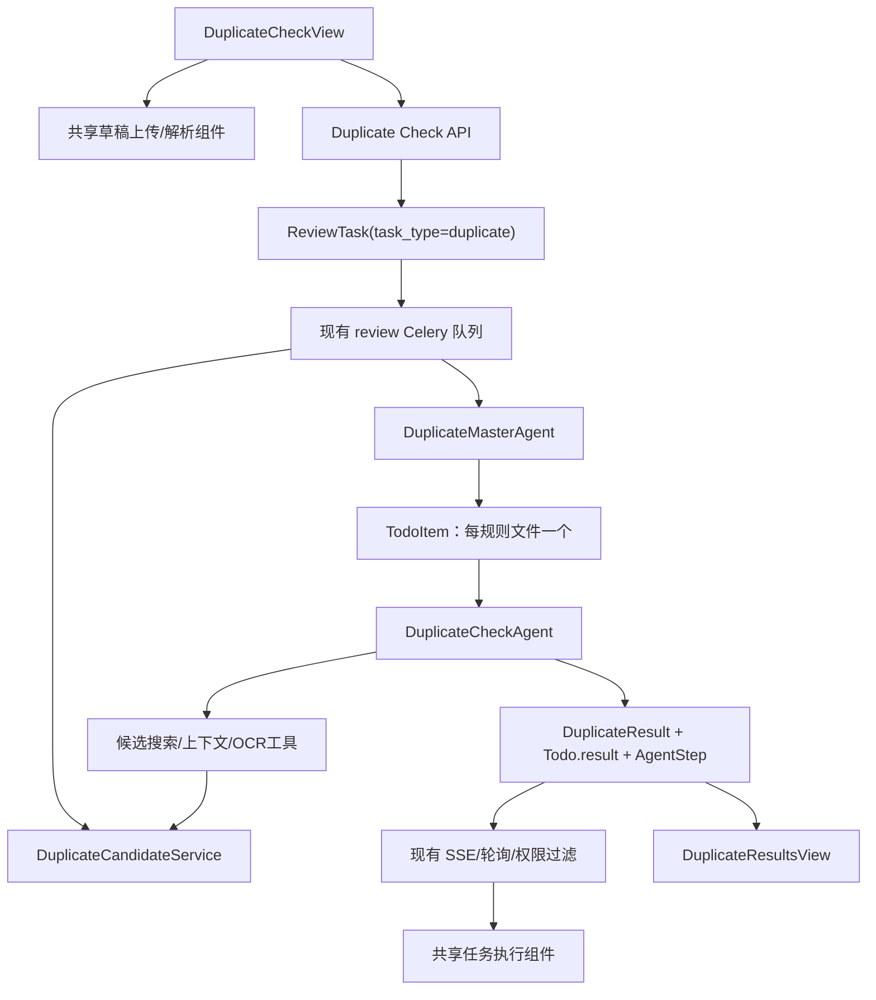

# 技术应标书查重功能：需求、设计与开发计划

> 状态：开发完成并通过专项自动化检查，待本地真实文档及预发布双角色验收
> 确认日期：2026-07-23
> 适用项目：bjt-agent
> 说明：本文是废弃旧查重实现后的全新设计基线，不继承旧实现的代码结构或数据模型。

## 1. 背景与目标

在现有“标书检查”之外增加“标书查重”能力。用户上传 A、B 两份技术应标书，系统复用现有文档解析和规则驱动多代理框架，对两份应标书进行文本、结构、数字、异常措辞及 OCR 异常等维度的重复性检查。

本功能的核心目标：

1. 外部用户和内部用户都能创建并执行查重任务。
2. 一个规则文件对应一个查重子代理，由查重主代理统一扫描、调度和汇总。
3. 查重结论必须给出双方原文、双方位置、相似度、结论和理由，不能只输出一个抽象分数。
4. 外部用户可查看完整最终证据，但不能查看代理思考过程或工具调用时间线。
5. 内部用户可查看主代理及每个子代理的完整执行时间线。
6. 最大限度复用现有项目创建、上传解析、任务调度、SSE、心跳、取消、计费、历史记录和结果展示基础设施。

## 2. 已确认需求

### 2.1 功能范围

- 左侧上传一份“A方技术应标书”。
- 右侧上传一份“B方技术应标书”。
- 每侧只允许一个文件，不支持多文件。
- 不要求用户填写 A、B 方公司名称。
- 支持的文件类型和单文件大小限制沿用现有标书检查：PDF、DOCX，最大 500 MB；旧版 DOC 继续拦截。
- 两个文件都解析成功后，“开始查重”按钮才可用。
- 查重完成后自动跳转结果页。
- 查重结果归类为：
  - `合理重复`
  - `疑似不合理重复`
- 每条结果显示相似度。
- 查重记录进入现有“历史标书”页面，通过项目类型筛选和标识区分。
- 支持重新查重，新任务不删除旧任务及旧结果。
- 沿用现有余额校验、按实际 AI 成本计费、积分和用户并发配置。

### 2.2 用户权限

| 能力 | 外部用户 | 内部用户 |
|---|---:|---:|
| 创建和执行查重 | 是 | 是 |
| 查看子代理名称、状态和进度 | 是 | 是 |
| 查看完整最终查重证据 | 是 | 是 |
| 查看主代理思考/工具时间线 | 否 | 是 |
| 查看子代理思考/工具时间线 | 否 | 是 |
| 查看其他用户项目 | 否 | 沿用现有内部用户只读规则 |
| 修改、取消其他用户任务 | 否 | 否 |

权限必须由后端强制执行，不能只依赖前端折叠或隐藏。

### 2.3 第一版明确不做

- 查重结果分享。
- 用户反馈和经验复盘。
- PDF/Word 报告导出。
- 用户自定义规则上传或在线编辑。
- 一侧多文档或多家公司交叉比对。
- 与互联网或全局历史标书库查重。
- 自动认定串标、围标或作出法律结论。

页面文案统一使用“疑似不合理重复”，避免把模型判断表述为确定的违法结论。

## 3. 核心业务流程


### 3.1 页面状态

1. 初始态：两侧均为空。
2. 上传中：展示真实字节进度；每侧上传按钮禁用。
3. 解析中：展示解析阶段、页数进度和预计剩余时间。
4. 解析失败：显示失败原因，允许删除后重新上传。
5. 就绪：两侧各一份且全部解析成功，可开始查重。
6. 执行中：显示任务进度；内部用户可展开完整时间线。
7. 部分失败：至少一个子代理成功时任务完成但展示“结果可能不完整”警告。
8. 全部失败：任务失败，不进入正常结果态。
9. 完成：自动跳转结果页。

### 3.2 单文件约束

单文件约束必须前后端同时保证：

- 前端：某侧已有上传中、解析中或解析成功文件时隐藏/禁用该侧上传按钮。
- 后端：草稿上传和关联项目时校验同一用户、同一查重草稿上下文、同一侧最多一份。
- 数据库/API：启动任务前再次校验恰好存在一份 `duplicate_left` 和一份 `duplicate_right` 且都为 `parsed`。

## 4. 总体技术方案

### 4.1 复用边界

直接复用：

- 用户认证及内部/外部用户身份。
- 文档上传、文件校验、解析任务、解析 SSE 和内容预览。
- Project、ReviewTask、TodoItem、AgentStep 的生命周期框架。
- Celery `parser` 和 `review` 队列。
- 主代理规则扫描、Todo 创建、并发限制、重试、取消和部分失败汇总思想。
- 任务 SSE、断线重连、轮询降级、心跳、超时和取消。
- AI 用量记录、任务汇总、余额校验及实际成本结算。
- 历史项目列表和软删除机制。

需要独立实现：

- 查重规则目录及规则文件。
- A/B 双方文档角色。
- 查重候选召回服务和查重专用工具。
- 查重子代理提示词和结构化输出。
- 查重结果数据表、API 和结果组件。

### 4.2 组件关系



## 5. 数据模型设计

### 5.1 projects

新增：

- `project_type VARCHAR(20) NOT NULL DEFAULT 'review'`
- 允许值：`review`、`duplicate`
- 索引：`(user_id, project_type, created_at)`

目的：历史页面筛选、动态路由和阻止普通审查接口误操作查重项目。

### 5.2 documents

沿用现有 `doc_type` 字段，增加两种业务值：

- `duplicate_left`
- `duplicate_right`

不新增公司名称字段。普通审查继续使用 `tender`、`bid`。

后端所有依赖 `doc_type` 的地方必须使用显式白名单，不能把非 `tender` 的文档一律当作 `bid`。

### 5.3 review_tasks

新增：

- `task_type VARCHAR(20) NOT NULL DEFAULT 'review'`
- 允许值：`review`、`duplicate`
- 索引：`(project_id, task_type, created_at)`

继续复用该表的状态、Celery task id、开始/结束时间、持续时间、心跳和最大并发字段。

### 5.4 todo_items 与 agent_steps

不新增查重专用 Todo/Step 表：

- `todo_items.session_id = review_tasks.id`
- 每个查重规则文件创建一个 TodoItem。
- TodoItem.result 保存该子代理汇总，例如总候选数、合理重复数、疑似不合理重复数和报告状态。
- AgentStep 继续保存主代理和子代理时间线。
- 外部用户禁止读取 AgentStep；内部用户按现有权限读取。

### 5.5 duplicate_results

新增独立表，避免污染现有 `review_results` 的“招标要求/投标响应”语义。

建议字段：

| 字段 | 类型 | 说明 |
|---|---|---|
| `id` | VARCHAR(36) | 主键 |
| `task_id` | FK review_tasks | 所属查重任务 |
| `todo_id` | FK todo_items | 产生结果的子代理 |
| `rule_doc_name` | VARCHAR(255) | 规则文件名 |
| `check_item_name` | VARCHAR(255) | 具体检查项 |
| `verdict` | VARCHAR(30) | `reasonable` / `suspicious` |
| `similarity_score` | NUMERIC(5,4) | 0～1，页面显示百分比 |
| `match_type` | VARCHAR(30) | exact/near_exact/semantic/structural/ocr_error/logic_anomaly |
| `left_document_id` | FK documents | A 方文件 |
| `left_excerpt` | TEXT | A 方证据原文 |
| `left_location` | JSONB | 章节、页码、行号等定位信息 |
| `right_document_id` | FK documents | B 方文件 |
| `right_excerpt` | TEXT | B 方证据原文 |
| `right_location` | JSONB | 章节、页码、行号等定位信息 |
| `explanation` | TEXT | 判定理由 |
| `suggestion` | TEXT NULL | 处理建议 |
| `evidence` | JSONB NULL | 数字、异常词、OCR 等补充证据 |
| `created_at/updated_at` | timestamptz | 审计时间 |

约束和索引：

- `verdict`、`similarity_score` 增加 CHECK 约束。
- `task_id`、`todo_id`、`verdict` 建索引。
- 删除项目时通过 ReviewTask 级联清理结果。
- API 返回文档原始文件名，不把服务器文件路径返回前端。

## 6. API 设计

保留普通审查 API 不变，新增查重命名空间：

| 方法 | 路径 | 用途 |
|---|---|---|
| POST | `/projects/{project_id}/duplicate-check` | 启动查重 |
| POST | `/projects/{project_id}/documents/attach-duplicate-pair` | 原子关联已解析的 A/B 草稿，避免只关联成功一侧 |
| GET | `/projects/{project_id}/duplicate-check/tasks` | 任务历史 |
| GET | `/projects/{project_id}/duplicate-check/tasks/{task_id}` | 任务状态 |
| POST | `/projects/{project_id}/duplicate-check/tasks/{task_id}/cancel` | 取消任务 |
| POST | `/projects/{project_id}/duplicate-check/tasks/{task_id}/heartbeat` | 前端心跳 |
| GET | `/projects/{project_id}/duplicate-check/tasks/{task_id}/stream` | SSE |
| GET | `/projects/{project_id}/duplicate-check/tasks/{task_id}/todos` | 子代理状态与汇总 |
| GET | `/projects/{project_id}/duplicate-check/tasks/{task_id}/steps` | 完整时间线，仅内部用户 |
| GET | `/projects/{project_id}/duplicate-check/tasks/{task_id}/results` | 完整最终结果 |

项目与草稿接口调整：

- 创建项目请求增加 `project_type`，服务端白名单校验。
- 项目列表支持可选 `project_type` 查询参数；不传时返回全部，兼容旧调用。
- 草稿上传接受新的文档角色，并执行单文件约束。
- 草稿关联时校验草稿所有者、项目类型和文档角色匹配。

所有查重写接口只允许项目所有者操作。内部用户只读查看他人项目时沿用现有规则。

## 7. 前端设计

### 7.1 导航和路由

- 导航新增“标书查重”，`internalOnly=false`。
- 建议路由：
  - `/home/duplicate-check`
  - `/home/projects/:id/duplicate-execution`
  - `/home/projects/:id/duplicate-results`
- “历史标书”增加项目类型筛选：全部、标书检查、标书查重。
- 历史列表增加“类型”列，并根据类型跳转到对应结果页。

### 7.2 创建页复用

创建页复用现有 Project store、草稿上传/解析 API、解析进度组件、SSE/轮询、
预览和删除逻辑；查重页只实现 A/B 双栏及单文件状态编排。普通标书检查继续
使用原页面，避免本次功能为了组件重构引入大范围回归。开始查重时通过原子接口
一次关联两份草稿，杜绝单侧关联成功造成的残缺项目。

### 7.3 执行页复用

抽取通用 `AgentTaskExecution` 或 composable，参数化：

- API adapter。
- 页面文案（审查/查重）。
- 完成后的结果路由。
- 结果统计名称。

保留现有 SSE 指数退避、Last-Event-ID、5 秒轮询降级、心跳、取消、刷新恢复和自动跳转逻辑。

外部用户只展示：

- 主任务状态。
- 每个规则对应的子代理名称、状态、进度。
- 完成/失败数量和结果数量。

内部用户额外展示所有 AgentStep，包括思考、工具参数和工具结果。

### 7.4 结果页

结果页顶部：

- 项目名称、A/B 文件名、任务时间、运行时长。
- 子代理总数、合理重复数、疑似不合理重复数。
- 任务切换和“重新查重”。

主体按规则文件/子代理分组，每条结果至少展示：

- 结论标签。
- 相似度百分比。
- 重复类型。
- A 方文件名、章节/页码和证据原文。
- B 方文件名、章节/页码和证据原文。
- 判定理由和建议。

没有命中的子代理也必须展示“未发现重复项”，以满足“显示每个子代理结果”的要求。

第一版不显示分享、反馈、复盘和导出按钮。

## 8. 查重算法与代理设计

### 8.1 设计原则

- 相似度由确定性工具计算，不能让大模型凭感觉编造百分比。
- 最终“合理/疑似不合理”由规则、候选证据和上下文共同决定，不能只设一个全局分数阈值。
- 先召回候选，再让子代理判断，禁止把两份超长标书全文一次性塞给模型。
- 结果必须引用双方真实原文和可追溯位置。

### 8.2 候选索引

任务开始后构建一次双方共享索引：

1. 读取解析后的 Markdown/结构化结果。
2. 按章节、段落、表格行和图片说明切片。
3. 保存文件、章节路径、页码、行号和图片引用。
4. 生成规范化文本和字符 n-gram 指纹，召回完全/近似复制。
5. 使用本地序列相似度、字符 n-gram、数字集合和结构特征计算可复算分数。
6. 提取数字、证书号、日期、项目代号等结构化特征。
7. 缓存索引和候选，所有规则子代理共享，避免重复调用 Embedding。

相似度展示建议采用工具输出的综合分数：

- 完全/近似文本：规范化文本相似度为主。
- 语义改写：第一版由字符序列与结构特征近似召回，不单独调用 Embedding。
- 表格、数字或结构：结构和关键字段一致度参与计算。
- 页面展示 0～100%，同时显示 match_type，避免一个分数掩盖计算方法。

### 8.3 主代理

`DuplicateMasterAgent` 工作流：

1. 扫描配置指定的查重规则目录。
2. 按稳定文件名排序。
3. 每个 `.md` 文件创建一个 TodoItem。
4. 按用户 JWT 中的并发数调度子代理。
5. 监听取消、心跳超时和总任务超时。
6. 每个子代理完成后增量保存结果。
7. 汇总全部子代理状态与结果数。
8. 至少一个子代理成功则允许任务完成；有失败时发送 warning。

应抽取现有 MasterAgent 的通用编排能力，普通审查和查重分别注入规则目录、Executor factory 和业务文案，避免复制两套重试/并发/取消代码。

### 8.4 子代理与工具

`DuplicateCheckAgent` 每次只执行一个规则文件，主要工具：

- `search_duplicate_candidates`：按规则关键词、相似度和类型检索 A/B 候选对。
- `get_duplicate_context`：读取候选前后文、章节和表格上下文。
- 候选结果包含章节和行号，可按候选 ID 读取双方上下文。
- 第一版基于文档解析后的文本检查相同 OCR 异常，不额外发起图像理解调用。

子代理输出必须通过 Pydantic/JSON Schema 校验；不合格结果触发有限重试。每条结果必须包含 verdict、score、双方原文、双方位置、类型和理由。

## 9. 规则文件设计

### 9.1 目录和配置

- 默认目录：`docs/rules-duplicate/`
- 环境配置：`DUPLICATE_RULE_LIBRARY_DIR`
- 生产节点通过现有代码同步机制分发规则文件。
- 规则文件属于代码配置，纳入 Git；不允许包含凭证或客户数据。

### 9.2 文件格式

```markdown
# D001 拟投入项目人员情况

## 检查目标
说明本规则关注的业务风险。

## 重点检查项
### 检查项1：个人业绩描述
- 检查方法：……
- 重点证据：……

## 合理重复
- 学历学位名称
- 通用职业资格等级名称

## 不合理重复
- 非标准、个性化承诺措辞高度一致

## 输出要求
- 必须引用 A、B 双方原文和位置
- 必须输出相似度及判定理由
```

### 9.3 第一批测试规则

1. `D001 拟投入项目人员情况.md`
   - 个人主导项目经验的核心动词、规模数字和叙述结构。
   - 社保单位、人员归属和其他公司内部项目代号。
   - 双方证书号中重复出现的 OCR 错误。
   - 非标准承诺措辞，例如“余必亲临，昼夜督造”。
   - 学历、学位及通用职业资格名称作为合理重复。
2. `D002 技术方案与实施组织设计.md`
   - 章节结构、实施步骤、项目规模数字、专有错误和个性化表达。
   - 国家标准名称、通用施工工序作为合理重复。
3. `D003 设备材料配置与技术参数.md`
   - 非招标强制参数的相同组合、表格顺序、异常型号和相同录入/OCR 错误。
   - 招标明确指定参数、标准单位和行业通用名称作为合理重复。
4. `D004 售后服务与质量保证承诺.md`
   - 非标准服务承诺、响应时间组合、相同联系人痕迹和相同错别字。
   - 法规要求、招标强制承诺和常用服务术语作为合理重复。

同时在测试目录生成短版 A/B Markdown 固件，覆盖合理重复、疑似重复、OCR 错误、无重复和无结果五类场景。

## 10. 计费、队列与运行保障

- 启动前沿用现有钱包余额大于 0 校验。
- 查重子代理的 LLM 调用记录到当前 ReviewTask/Todo 的 usage context。
- 第一版相似度完全在本地计算，不调用未纳入计费的 Embedding 接口。
- 任务成功后沿用实际成本折算“文”和积分规则。
- 任务失败/取消时仍刷新任务级用量汇总；结算行为与现有审查保持一致。
- 查重 Celery task 路由到现有 `review` 队列，文档解析继续走 `parser` 队列。
- 沿用用户并发数、子代理信号量、进度 watchdog、绝对超时和 worker hard limit。
- 重新查重创建新任务，不覆盖旧任务、旧 Todo 或旧结果。

## 11. 开发计划

### Phase 0：基线清理

状态：已完成。

- 保留旧功能提交的 revert，不复用旧实现。
- 确认工作树不含旧查重未跟踪文件。
- 新开发完成后把 revert 与新实现一起推送。

完成标准：分支历史可正常 fast-forward 推送，工作树中不存在旧实现残留。

### Phase 1：数据模型与后端基础

状态：已完成。

- 新增数据库迁移。
- 扩展 Project、Document、ReviewTask schema。
- 新增 DuplicateResult model/schema。
- 增加项目类型筛选和服务端单文件校验。
- 新增查重 API 骨架及权限校验。

完成标准：迁移可重复安全执行；普通审查 API 回归通过；越权请求返回 403/404。

### Phase 2：共享前端组件与创建页

状态：已完成（采用复用 store/API/解析组件的低风险方案，未强制拆分原 CheckView）。

- 复用项目 store、草稿上传/解析、进度、预览和删除能力。
- 保持现有 CheckView 页面结构，仅补充业务角色隔离。
- 新增查重导航、路由和 DuplicateCheckView。
- 实现每侧单文件限制及开始条件。

完成标准：普通检查 UI/行为无回归；查重页完成上传、解析、预览、删除和启动闭环。

### Phase 3：候选召回与规则文件

状态：已完成。

- 实现结构化切片、文本规范化、指纹/序列/数字结构召回和任务缓存。
- 实现查重工具及结构化结果 schema。
- 创建四份测试规则和 A/B 测试固件。

完成标准：固定测试语料能稳定召回预期候选；相似度可复算；不向模型发送完整超长文档。

### Phase 4：主代理、子代理与异步任务

状态：已完成。

- 实现查重规则驱动的主代理编排层。
- 实现 DuplicateMasterAgent 和 DuplicateCheckAgent。
- 实现 Celery task、增量保存、SSE、心跳、取消、超时、部分失败和计费。

完成标准：一个规则文件对应一个 Todo；并发受用户配置限制；刷新页面后能恢复任务进度和内部时间线。

### Phase 5：执行页、结果页与历史记录

状态：已完成。

- 抽取并复用任务执行页逻辑。
- 新增查重结果页和每个子代理的零结果状态。
- 历史页增加类型筛选、类型标识和动态跳转。
- 实现重新查重。
- 移除第一版非目标入口。

完成标准：任务完成自动跳转；外部用户可看完整结果但无法通过 API/SSE 获取时间线；内部用户可看完整时间线。

### Phase 6：验证、文档与发布准备

状态：进行中。专项后端测试、Python 编译/导入和前端生产构建已通过；真实大文档、
本地完整服务链及预发布内外部账号验收尚未执行。

- 后端单元、API、任务和权限测试。
- 前端类型检查、生产构建和 Playwright 主流程。
- 本地真实解析/查重冒烟测试。
- 补充数据库文档、配置示例和预发布验证清单。

完成标准：全部自动化测试通过；预发布完成内外部账号双角色验证；普通审查主流程回归通过。

## 12. 测试矩阵

### 12.1 后端

- 一个规则文件只创建一个 Todo，规则按文件名稳定排序。
- 左右角色隔离，不能把 A 方结果作为 B 方证据。
- 每侧第二份文件被服务端拒绝。
- 文件未解析、缺少任一侧、项目类型不符时禁止启动。
- 相似度在 0～1 范围且可重复计算。
- 合理/疑似结果完整持久化，零结果子代理仍有汇总。
- 一个子代理失败时任务 warning；全部失败时任务 failed。
- 取消、心跳超时和绝对超时能正确落终态。
- 外部用户 steps API 返回 403，SSE 不包含 step/tool 事件。
- 外部用户可读取自己项目的最终结果，不能读取他人项目。
- 重新查重保留旧任务和旧结果。
- 计费只结算一次，重复回调幂等。

### 12.2 前端与端到端

- 内外部账号都能看到“标书查重”导航。
- 每侧只能选择/保留一份文件。
- 上传、解析、失败、删除、重传、刷新恢复状态正确。
- 两侧解析完成前不能开始查重。
- SSE 中断后自动轮询，恢复后不重复事件。
- 完成后自动跳结果页。
- 外部账号无时间线展开内容，内部账号可完整展开。
- 结果按子代理分组，合理和疑似标签、相似度、双方证据完整。
- 历史页筛选和动态跳转正确。
- 重新查重后任务选择器可查看新旧任务。
- 普通标书检查创建、执行、结果和历史流程无回归。

### 12.3 性能与稳定性

- 以两份接近最大业务页数的技术应标书做候选索引压力测试。
- 候选数量设置上限，避免平方级结果进入大模型。
- 候选缓存、候选上限和本地相似度计算耗时可观测。
- 多子代理并发不超过用户配置及节点容量。
- 任务日志能够按 task_id、todo_id 定位。

## 13. 验收标准

以下条件全部满足才视为第一版完成：

1. 内外部用户均能从导航进入查重页。
2. A/B 两侧各且仅能上传一份 PDF/DOCX，并完成解析。
3. 点击开始后按查重规则目录创建多个子代理并发执行。
4. 内部用户能查看完整主/子代理时间线，外部用户通过页面和 API 都无法获取时间线明细。
5. 完成后自动跳转，页面显示每个子代理的结果或“未发现重复项”。
6. 每条结果包含合理/疑似结论、相似度、双方证据、双方位置和理由。
7. 历史标书页面能筛选、打开和重新执行查重项目。
8. 余额、用量、计费、取消、超时和部分失败行为符合现有审查约定。
9. 第一批四份规则及测试固件进入 Git。
10. 普通标书检查主流程没有回归。

## 14. 主要风险及控制

- **误报法律风险**：统一使用“疑似不合理重复”，展示证据和规则，不输出法律定性。
- **大文档成本与时延**：候选预召回、任务级缓存和每规则 top-K 上限；不产生额外 Embedding 成本。
- **模型生成虚假相似度**：相似度只接受工具计算结果，输出 schema 强校验。
- **外部用户泄漏时间线**：后端 steps 权限和 SSE 事件过滤双重控制，并增加安全测试。
- **共享组件改造引发普通审查回归**：先补行为测试，再小步抽取；普通审查路由和 API 保持兼容。
- **集群节点规则不一致**：规则文件随代码同步，部署验证三节点文件 hash 一致；同步时继续排除 `.env`。
