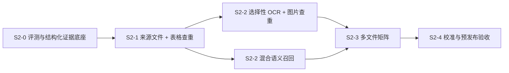
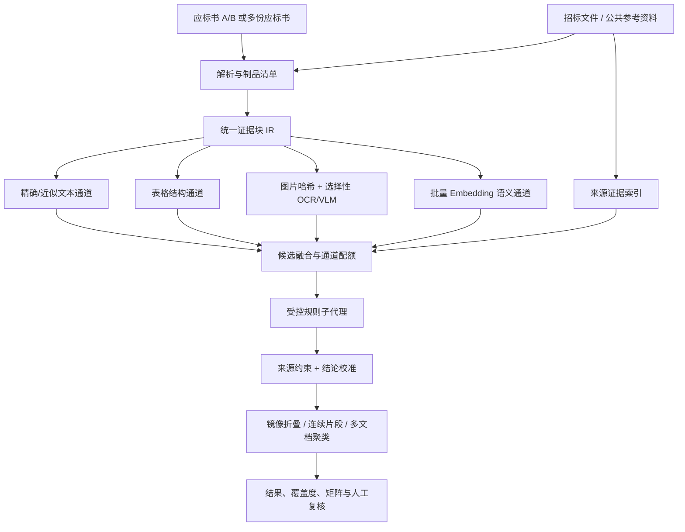

# 技术应标书查重第二阶段能力规划

> 状态：规划草案（2026-07-26）
> 前置基线：第一阶段已具备 A/B 单文件查重、相同文件哈希短路、确定性文本候选、证据强度、来源约束、结果聚合和 `unknown` 结论。
> 本阶段原则：提升证据覆盖、来源可信度和规模能力，不把系统改造成开放式自主代理，也不输出串标、围标等法律定性。

## 1. 阶段目标

第二阶段把当前“Markdown 段落级 A/B 查重”升级为“有覆盖度、有来源、有结构、有多模态证据、可扩展到多份应标书的查重系统”。

核心能力分为五条主线：

1. **来源可证**：允许附带招标文件和经过快照固化的公共参考资料，减少因来源缺失产生的 `unknown`。
2. **结构化表格**：按表头、行、列、单位、型号、数字组合和异常单元格检查，不再把表格仅视为普通字符串。
3. **选择性 OCR / 图片证据**：覆盖扫描 PDF、证书、截图、图表及相同图片异常，但只对高价值候选调用 OCR/VLM。
4. **混合语义召回**：在确定性文本召回之外增加 Embedding 通道，发现改写、同义替换和结构保持的语义重复。
5. **多文件矩阵**：从 A/B 两份扩展到多家投标文件，形成文档对矩阵和跨文档证据簇。

推荐实施顺序：



## 2. 当前基线与关键缺口

| 维度 | 当前能力 | 第二阶段缺口 |
|---|---|---|
| 文本 | 字符 n-gram、序列相似度、数字结构、证据强度 | 难发现高质量改写和同义表达 |
| 表格 | Markdown 块和简单 table 标记 | 没有表头对齐、行列映射、单位归一和异常单元格证据 |
| 图片/OCR | 普通审查已有图片枚举、RapidOCR、百度 OCR、视觉模型工具 | 查重流程未接入；扫描 PDF 仍直接拒绝 |
| 来源 | 仅 A/B 应标书，来源依赖断言降级为 unknown | 无招标文件/公共资料证据链和来源快照 |
| 规模 | 每侧仅一份文件 | 无 3～10 份文档的矩阵、聚类和总体风险视图 |
| 评测 | 单元固件和少量真实任务分析 | 缺少标注集、召回/精度/过度聚合指标和版本对比 |
| 用量 | LLM/OCR 已记录成本 | Embedding 没有用量类型、批量缓存和成本结算 |
| 调度 | 查重任务运行在 review 队列 | OCR、Embedding、多文件索引可能挤占审查 Worker |

需要先修复的基础事实：

- PDF 解析已经生成 Docling JSON，但保存流程尚未把 `docling_json_path` 稳定写回 `Document`。
- Docling 对 PDF 开启了表格结构提取；DOCX/Markdown 则需要统一适配成同一套中间结构。
- 当前 `EmbeddingService` 逐条请求，缺少批量接口、任务缓存、用量记录和降级策略，不适合直接接入查重主流程。
- 当前扫描 PDF 文本过短时直接失败，尚无页面级 OCR 回退和覆盖度报告。

## 3. 范围与非目标

### 3.1 本阶段范围

- A/B 查重增加可选招标依据文件和公共参考资料。
- PDF、DOCX 统一生成结构化证据块。
- 表格、图片 OCR、图片相似、语义改写成为独立候选通道。
- 每条结果显示证据通道、覆盖情况、来源依据和可追溯位置。
- 支持最多 10 份应标书的批量查重试点。
- 建立人工标注、反馈和版本评测机制。

### 3.2 明确非目标

- 不做互联网全网查重；公共来源第一版只接受用户上传或管理员维护的可版本化资料。
- 不跨企业共享历史标书语料，不建立未经授权的全客户标书库。
- 不输出“串标成立”“围标成立”等法律结论。
- 不让 LLM 自主无限调用工具；仍采用受控、有限、可复算的工作流。
- 不在第二阶段首版支持无限文件数；批量模式初始上限建议为 10 份。

## 4. 目标数据流



## 5. 能力包 S2-0：评测与统一证据底座

这是后续所有能力的强制前置，不应跳过。

### 5.1 统一证据块 IR

建议建立 `DuplicateEvidenceBlock`，至少包含：

- `block_id`、`document_id`、`document_role`、`party_key`
- `content_type`：paragraph / heading / table / table_row / image_ocr / caption
- `section_path`、`page_number`、`bbox`、`start_line`、`end_line`
- `raw_text`、`normalized_text`、`normalized_hash`
- `numbers`、`models`、`units`、`dates`、`identifiers`
- 表格字段：`table_id`、`row_index`、`column_index`、`header_map`
- 图片字段：`image_path`、`image_sha256`、`perceptual_hash`、`ocr_confidence`
- `parser_name`、`parser_version`、`artifact_hash`、`source_basis`

PDF 优先读取 Docling JSON；DOCX/Markdown 使用结构适配器产生同一 IR。Markdown 只作为展示和回退来源，不再承担全部结构语义。

### 5.2 解析制品清单与覆盖度

每份文档生成版本化 manifest：

- 原始文件 hash、解析文件 hash、解析器版本。
- 总页数、成功解析页数、扫描页数。
- 段落数、表格数、图片数、已 OCR 图片数。
- 无法定位或无法识别的对象数量。
- 文本、表格、图片三个维度的覆盖率。

任务结果增加 `coverage_status=complete|partial|insufficient`。覆盖不足时必须展示警告，并允许规则结果降级为 `unknown`。

### 5.3 标注集与版本评测

建立去标识化评测集，建议首批至少包含：

- 30 组精确/近似文本样本。
- 20 组语义改写样本。
- 20 组表格结构与参数组合样本。
- 15 组图片/OCR/扫描件样本。
- 15 组招标强制或公共来源排除样本。
- 10 组无重复及高频通用短语样本。
- 5 组多文件证据簇样本。

每次算法发布输出版本对比报告，至少记录 candidate recall@K、报告精度、unknown 比例、聚合前后条数、成本和耗时。

## 6. 能力包 S2-1：来源文件与结构化表格

### 6.1 来源可证

查重项目增加两类可选依据：

- `duplicate_tender`：本项目招标文件。
- `duplicate_public_reference`：厂家说明书、标准文本、公共模板等固化资料。

来源规则：

- 只有候选能引用具体来源文档 ID、原文、位置和文件 hash 时，`source_basis` 才允许为 `tender` 或 `public`。
- 公共资料必须保存快照和版本，不使用模型记忆或即时网页摘要作为正式证据。
- 来源匹配只用于解释“为何重复可能合理”，不能自动覆盖 A/B 之间的异常错误、内部代号等独立风险证据。

新增受控工具：

- `search_duplicate_sources`：在招标/公共参考块中检索候选来源。
- `get_duplicate_source_context`：读取来源原文、章节、页码和版本信息。

### 6.2 表格结构查重

表格候选不与普通段落共用一套评分。建议独立计算：

- `header_similarity`：表头名称和列顺序相似度。
- `row_alignment_score`：行顺序和主键字段对齐度。
- `numeric_signature_score`：型号、数量、单位、比例、小数点组合。
- `rare_cell_overlap`：罕见备注、内部编码、异常单位和错误值重合。
- `table_structure_score`：合并单元格、列数、排序等结构特征。

结果页面提供表格行列对照，而不是只展示压平后的 Markdown 文本。

### 6.3 S2-1 验收门槛

- 招标/公共来源结论 100% 带可追溯来源证据；无来源时不得填写 tender/public。
- 标注集表格候选 recall@20 初始目标不低于 90%。
- 相同异常单位、错误型号和内部备注能够定位到具体行列。
- PDF 与 DOCX 的同一逻辑表格能进入统一 IR。
- 来源检索或表格解析失败时，任务可降级完成并明确 coverage，不得静默忽略。

## 7. 能力包 S2-2A：选择性 OCR 与图片证据

### 7.1 OCR 分层策略

按成本从低到高执行：

1. 原始图片 SHA-256：识别完全相同图片。
2. 感知哈希：识别缩放、压缩、轻微裁剪后的近似图片。
3. 本地 RapidOCR：提取证书号、联系人、型号、截图文字。
4. 远程百度 OCR：本地识别低置信度时回退。
5. VLM：仅用于图表结构或 OCR 无法表达的视觉内容。

所有 OCR/VLM 结果按图片 hash 缓存，重复任务不重复计费。

### 7.2 扫描 PDF

当前“文本不足 100 字即失败”改为页面级分类：

- 可提取文本页：沿用普通解析。
- 扫描页：进入 OCR 队列。
- 混合 PDF：仅 OCR 扫描页。

OCR 后仍要保留页码和 bbox；无法识别的页面计入覆盖不足，不能以“无命中”替代。

### 7.3 图片查重结果

图片 finding 至少包含：

- 双方图片缩略图和安全预览地址。
- 页码、章节、图片编号和 bbox。
- 图片 hash / 感知 hash 距离。
- OCR 文本及置信度。
- 是否属于公共模板、Logo 或标准证书版式。

### 7.4 S2-2A 验收门槛

- 标注集完全相同图片召回率不低于 98%。
- 轻微缩放/压缩图片召回率初始目标不低于 90%。
- OCR 关键编号样本召回率初始目标不低于 85%。
- OCR/VLM 失败均有用量和错误记录，并降级为 unknown/partial coverage。
- 默认不对所有图片调用付费服务，付费调用量必须受任务预算限制。

## 8. 能力包 S2-2B：混合语义召回

### 8.1 定位

Embedding 只负责补充候选召回，不直接产生最终 verdict，也不覆盖确定性相似度。

每个候选保留分离字段：

- `lexical_score`
- `semantic_score`
- `structure_score`
- `image_score`
- `evidence_strength`
- `hybrid_rank`（仅内部排序）

页面不得把 `hybrid_rank` 当成单一“相似度百分比”展示。

### 8.2 技术方案

- 按 normalized hash 去重后批量生成向量。
- 只嵌入长度、语言和内容类型符合条件的块；短标题、高频模板不进入语义通道。
- A/B 模式先采用任务内批量矩阵或轻量 ANN，不立即引入 pgvector。
- 多文件或历史参考库达到规模门槛后，再评估 pgvector/HNSW。
- Embedding 服务增加 batch、限流、超时、熔断和缓存。
- `ai_usage_records` 新增 `usage_type=embedding`，任务汇总增加调用量、输入量和成本。
- Embedding 不可用时自动退回确定性通道，不应使整项查重失败。

### 8.3 候选融合

各通道采用配额而非单一总分抢占：

- 精确/近似文本候选。
- 表格/数字结构候选。
- 语义改写候选。
- 图片/OCR 候选。

通道内排序后再去重，避免语义高分候选把精确异常或表格候选挤出 top-K。

### 8.4 S2-2B 验收门槛

- 语义改写标注集 candidate recall@20 初始目标不低于 85%。
- 通用模板和短文本误报率不得高于第一阶段基线。
- Embedding 缓存命中任务不产生重复外部调用。
- Embedding 成本、耗时和失败率能按 task/todo/provider 查询。
- 关闭 Embedding 功能开关后，第一阶段结果保持可复现。

## 9. 能力包 S2-3：多文件矩阵

### 9.1 产品形态

同一 `duplicate` 项目增加 `pair|batch` 模式：

- `pair`：保持现有 `duplicate_left` / `duplicate_right` 兼容。
- `batch`：允许上传 3～10 份 `duplicate_bid`，每份配置投标人标签或匿名编号。
- 两种模式都可附带 `duplicate_tender` 和公共参考资料。

### 9.2 算法避免 N² 全量比较

不逐对遍历所有块。采用全局任务索引：

1. 所有文档块统一建索引。
2. 精确 hash 直接形成跨文档簇。
3. lexical/semantic/table/image 通道只召回不同文档的 top-K 邻居。
4. 将候选转换为文档图：文档为节点，证据簇为边。
5. 同一证据跨 3 份以上文档出现时生成 cluster finding，而不是重复生成多条 pair finding。

### 9.3 数据与接口

建议新增：

- `duplicate_document_members`：任务内文档、party_key、显示名和顺序。
- `duplicate_occurrences`：finding 下的所有文档位置，不再只依赖 JSON occurrences。
- `duplicate_pair_summaries`：文档对统计、最高风险、各通道命中数。

新增只读接口：

- 任务覆盖度。
- 文档对矩阵。
- 证据簇列表。
- finding occurrences 明细。

现有 pair 结果接口保持兼容。

### 9.4 前端

- 上传页：文件列表、投标人标签、解析/覆盖状态。
- 总览页：文档对热力矩阵，颜色只代表“需复核证据强度”，不代表违法概率。
- 簇详情：展示同一内容在哪些文档、章节、表格或图片中出现。
- 支持按规则、通道、来源、结论和文档对筛选。

### 9.5 S2-3 验收门槛

- 10 份文档的任务不会创建 45 套独立 LLM 子流程。
- 同一跨文档内容簇只产生一个 finding，并保留全部 occurrences。
- 文档矩阵统计与 finding/occurrence 数据可相互复算。
- 任一文档解析失败时明确标记该文档覆盖不足，其余文档仍可完成。
- 权限、软删除、历史记录和计费保持项目级隔离。

## 10. 规则与代理协议升级

规则文件建议增加 YAML front matter，例如：

```yaml
candidate_types: [paragraph, table_row, image_ocr]
source_requirements: [tender_optional, public_optional]
channels: [lexical, structure, semantic]
max_candidates: 40
min_evidence_strength: 0.35
```

规则执行流程固定为：

1. 按规则元数据选择候选通道。
2. 工具检索并按通道配额融合。
3. 只为高价值候选补充上下文、来源或 OCR。
4. LLM 输出结构化结论。
5. 服务端绑定不可变证据、执行来源约束和覆盖度降级。
6. 聚合、持久化并生成覆盖报告。

禁止让子代理自主决定是否扫描全量图片、全量网页或无限扩大检索范围。

## 11. 数据模型与兼容策略

建议分步迁移，不一次重构现有表：

### 11.1 第一批字段

- `documents`：稳定保存 `docling_json_path`、解析器版本和解析覆盖摘要。
- `duplicate_results`：增加 `confidence`、`coverage_status` 和通道分数 JSON。
- `ai_usage_records` / task summary：增加 embedding 用量字段。

### 11.2 批量模式表

- `duplicate_document_members`
- `duplicate_occurrences`
- `duplicate_pair_summaries`

### 11.3 兼容要求

- 现有 pair 项目和 022/025 数据不迁移为新模式也能正常读取。
- 前端对新增字段使用默认值，允许灰度期间新旧后端短暂并存。
- 候选缓存增加 `schema_version` 和算法版本，旧缓存不直接复用到新算法。

## 12. 用量、队列和集群方案

### 12.1 用量

- Embedding、OCR、VLM 均纳入 usage context 和最终结算。
- 每任务设置 provider 调用上限和预算上限。
- 缓存命中记录为本地命中，不重复计费。
- 结果页可向内部用户展示各通道调用量和降级原因。

### 12.2 队列

S2-0 先做基准测试，再决定是否新增 `duplicate_index` 队列。推荐目标形态：

- `parser`：Docling、扫描页 OCR 和解析制品生成。
- `duplicate_index`：表格索引、图片 hash、Embedding 和多文件候选构建。
- `review`：规则子代理和 LLM 判断。

索引任务必须单实例执行并使用 Redis 锁，防止同一 task 在共享 NFS workspace 上重复写缓存。

### 12.3 降级

- Embedding 不可用：保留 lexical/structure 通道。
- 远程 OCR 不可用：保留本地 OCR 和图片 hash，标记 partial coverage。
- VLM 不可用：不得影响文本/表格任务完成。
- 参考资料缺失：来源依赖结论保持 unknown。

## 13. 里程碑与交付物

| 里程碑 | 主要交付 | 进入下一阶段的门槛 |
|---|---|---|
| S2-0 | 统一 IR、artifact manifest、coverage、标注集、基准脚本 | 第一阶段结果可回放；评测报告可自动生成 |
| S2-1 | 招标/公共来源、来源工具、表格结构候选、表格对照 UI | 来源越界为 0；表格 recall 达标 |
| S2-2A | 扫描 PDF、图片 hash、选择性 OCR/VLM、图片结果 UI | 图片/OCR 标注集达标；成本可控 |
| S2-2B | 批量 Embedding、混合召回、用量记录、功能开关 | 语义 recall 提升且普通模板误报不回退 |
| S2-3 | 3～10 份批量模式、矩阵、证据簇和 occurrences | 10 文件稳定性、权限和统计可复算通过 |
| S2-4 | 阈值校准、预发布双角色验收、回滚和运维文档 | 所有发布门槛满足 |

推荐并行关系：S2-1 完成后，S2-2A 与 S2-2B 可以并行；S2-3 必须等待二者的候选协议稳定。

## 14. 发布门槛

第二阶段功能进入默认开启前，至少满足：

1. 第一阶段 26 项专项测试及后续回归全部通过。
2. 标注集按文本、表格、语义、图片、来源分别出具 recall/precision 报告。
3. 不存在无来源却输出 tender/public 的结果。
4. coverage 不足时页面有明确警告，不能显示绝对化“未发现重复”。
5. 聚合过度合并率低于 2%，且所有原始 occurrences 可追溯。
6. Embedding/OCR/VLM 用量能够计费、限额和审计。
7. pair 模式性能和结果不低于第一阶段基线。
8. 10 文件批量压力测试不出现 O(N²) LLM 调用和内存失控。
9. 预发布完成内部/外部账号、PDF/DOCX/扫描 PDF 和取消/超时/重试验证。
10. 生产具备功能开关，可分别关闭 semantic、ocr、vision 和 batch 模式。

## 15. 首批开发建议

建议下一轮实施只启动 S2-0，不同时打开所有能力。首批任务顺序：

1. 修复并验证 `docling_json_path` 持久化。
2. 定义 `DuplicateEvidenceBlock` 和 artifact manifest schema。
3. 为现有 Markdown 候选提供 IR 适配层，保证第一阶段算法输出不变。
4. 增加 coverage API 和内部诊断页面。
5. 建立去标识化标注集、回放脚本和版本评测报告。
6. 完成表格/来源方案的数据库与 API 详细设计评审。

完成 S2-0 后，再根据实测解析覆盖和候选召回数据冻结 S2-1 的阈值、成本预算和工作量。

## 16. S2-0 实施进展（2026-07-26）

本轮已落地工程底座：

- 新增版本化 `DuplicateEvidenceBlock` IR，当前 Markdown 适配器可稳定生成 heading、paragraph、table、table_row 和 image 块，并保留章节、行号、数字、型号、单位、日期、标识符与图片 hash。
- 每次文档解析原子写入 evidence JSON 和 artifact manifest；`Document` 持久化 `docling_json_path`、manifest/evidence 路径、解析器名称/版本和 coverage summary。
- 新增迁移 `026_add_document_artifacts.sql`，并为 `duplicate_results` 增加 confidence、coverage_status 和独立通道分数字段。
- 覆盖度字段采用失败闭合默认值；开发库中既有 35 条历史结果已从错误的 `complete` 修正为 `insufficient`，结果接口按文档制品实际覆盖度再次校准。
- 新增项目文档和草稿文档 artifact API；API 不返回绝对工作区路径。
- 新增内部“文档解析诊断”页，可查看覆盖状态、制品 hash、警告和证据块明细。
- 查重结果页在 coverage 非 complete 时显示明确警告；旧任务没有覆盖度记录时按 partial 展示，不伪装成完整覆盖。
- 新增离线基准工具 `scripts/duplicate_benchmark.py` 和首个第一阶段固定样例；当前样例 `recall@20=100%`，且不调用 LLM。

仍需通过后续数据工作完成：

- 将去标识化评测集扩充至本规划第 5.3 节建议的规模，并由业务人员完成正负例标注。
- 选取真实 PDF/DOCX 样本校准 page/table/image coverage 规则；当前 DOCX 无可靠页数时保持 `null`，不估算页数。
- 是否把 PDF 默认解析器切换为 Docling 需通过解析耗时、内存和表格覆盖基准后单独决定；本轮保持现有 Markitdown 主路径，Docling 被调用时其 JSON 路径已可稳定持久化。

基准回放命令：

```powershell
D:\miniconda3\envs\bjt-agent\python.exe scripts/duplicate_benchmark.py backend/tests/fixtures/duplicate/benchmark_cases.jsonl --top-k 20
```

## 17. S2-1 至 S2-4 实施状态（2026-07-26）

- S2-1 已落地来源快照、受控来源检索、结构化表格通道和行列对照 UI。
- S2-2A 已落地扫描页分类、图片 hash/感知 hash、选择性 OCR、图片证据和预算降级。
- S2-2B 已落地批量 Embedding、缓存、熔断、混合召回、用量及成本记录；默认保持关闭。
- S2-3 已落地 pair/batch 模式、3–10 份文档全局索引、矩阵、cluster、occurrence 规范化表和前端视图；batch 默认受灰度开关保护。
- S2-4 已落地算法版本、阈值配置、任务级 feature snapshot、分类 benchmark、10 文档压力工具、release gate 及预发布/回滚手册。

尚不能由本机自动化替代的发布事项：真实业务标注集扩充、预发布内外部账号双角色验收、真实 PDF/DOCX/扫描 PDF 校准及生产发布审批。release gate 对缺失分类或缺失来源/聚合标注采用失败闭合，不会伪报通过。

## 18. S2 收尾验证记录（2026-07-26）

- 后端 `compileall` 和前端 `npm run build` 均通过；前端仅保留既有的大 chunk 警告，不影响构建产物生成。
- 查重专项测试（含本轮新增的 batch attach、启动开关/数量/重复文件防护、coverage/matrix/cluster/occurrence API 和 029/030 迁移契约）共 70 项通过；AI 用量独立复核脚本通过。
- 10 文档离线压力测试通过：45 个文档对、4 条独立规则流、共享簇 occurrences=10、`n_squared_llm_flows=false`、0 次 LLM 调用；本机实测约 5.3 秒、峰值约 3.6 MB。
- 当前固定基准只有 `text` 类样本，回放结果 `recall@20=1.0`、`precision@20=1.0`；release gate 正确因缺少 table/semantic/image/source 以及来源/聚合标注而失败闭合。
- 全量后端测试中的数据库集成用例连接到尚未执行 029/030 的现有数据库，出现 `projects.duplicate_mode` 缺失；本轮未直接修改预发布/共享数据库，需由 DBA/发布流程按迁移顺序执行后再重跑集成套件。
