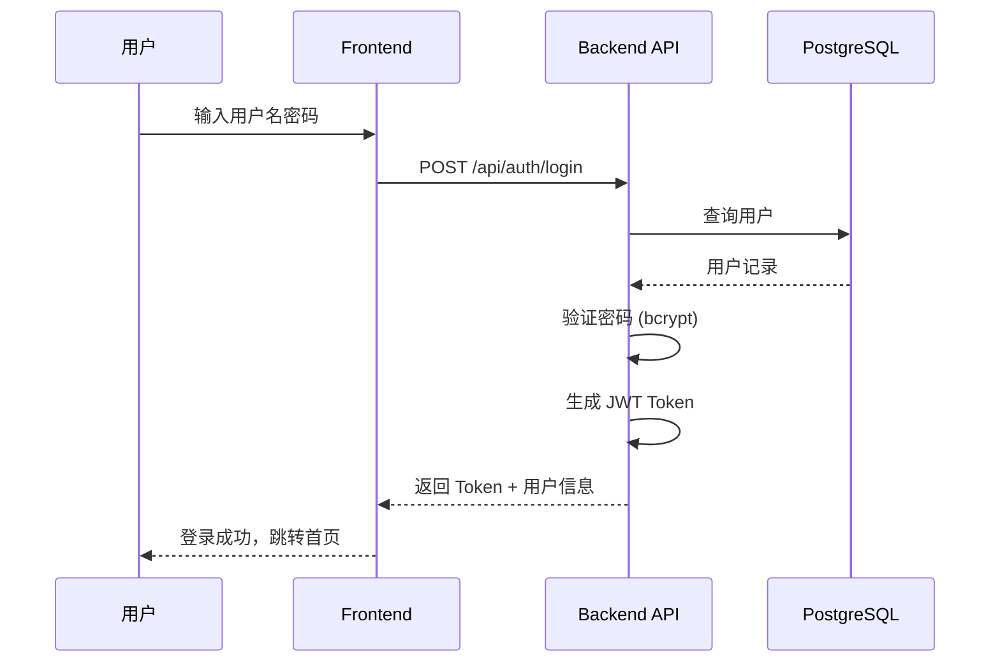
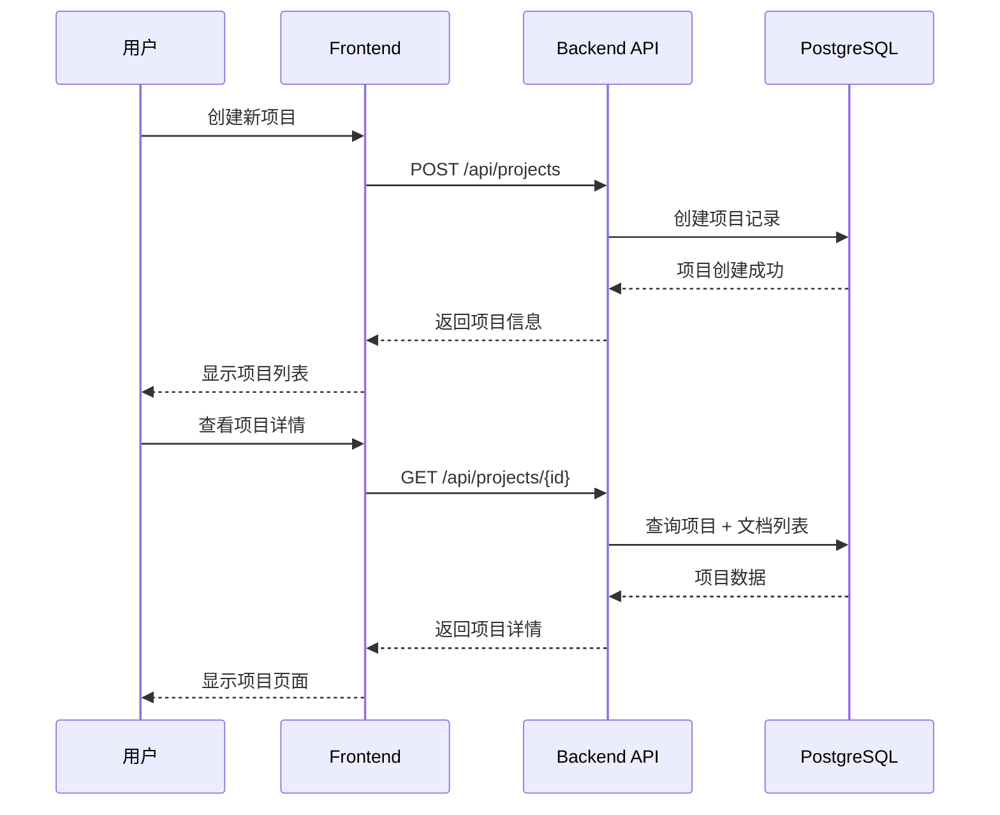
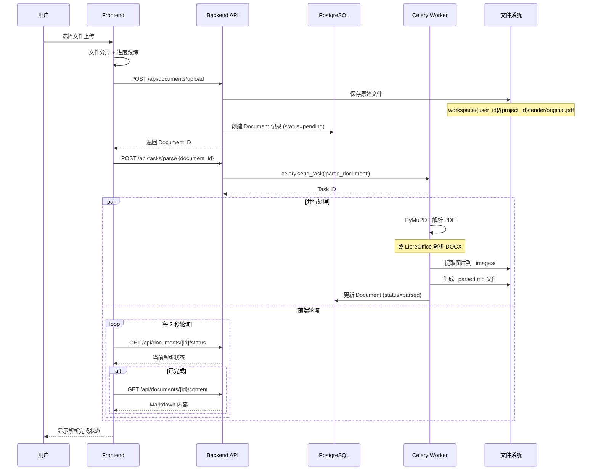
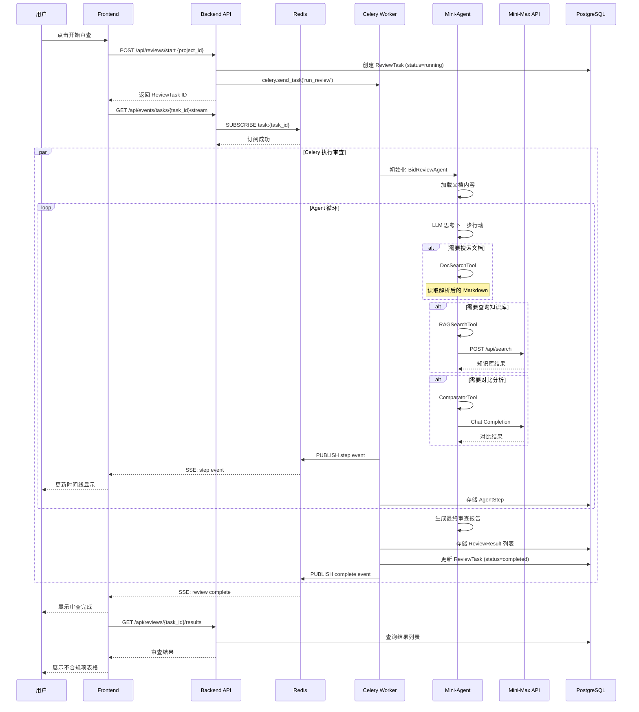
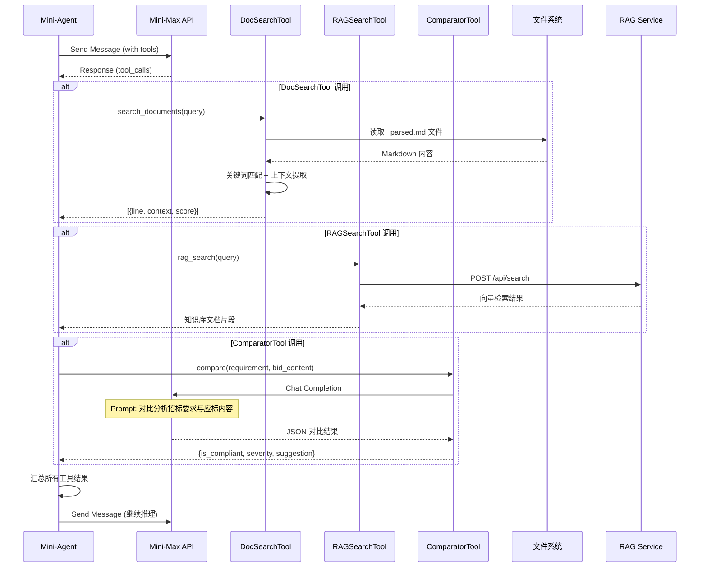
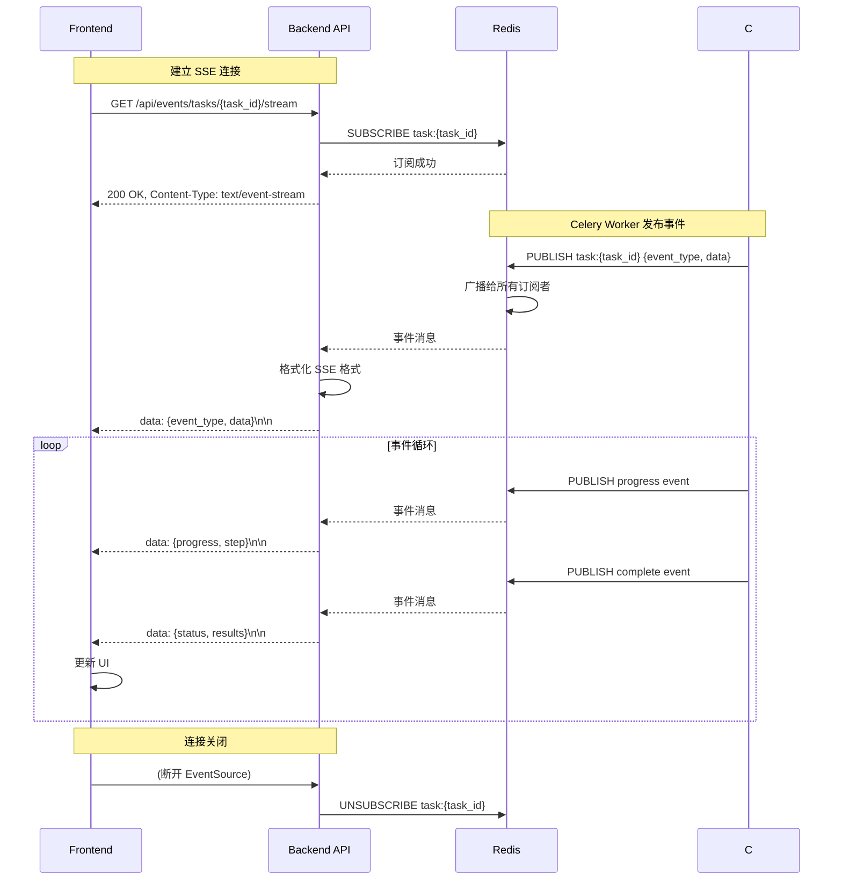

# Bid Review Agent System - 架构说明

## 项目概述

这是一个**标书审查智能体系统** (Bid Review Agent System)，使用 Vue3/FastAPI 技术栈，将招标书与应标书进行对比，自动识别不合规项。

---

## 整体架构

```
┌─────────────────┐     SSE      ┌──────────────┐           ┌────────────────┐
│   Frontend      │◄────────────►│   FastAPI    │──────────►│  Celery Workers│
│   (Vue3)        │              │   Backend    │           │                │
└─────────────────┘              └──────────────┘           └───────┬────────┘
                                      │                            │
                                      ▼                            ▼
                               ┌──────────────┐           ┌────────────────┐
                               │  PostgreSQL  │           │  Redis         │
                               │  (数据持久化) │           │  (Broker+SSE)  │
                               └──────────────┘           └────────────────┘
                                      │
                                      ▼
                               ┌──────────────┐
                               │RAG Memory    │
                               │Service       │
                               └──────────────┘
                                      │
                                      ▼
                               ┌──────────────┐
                               │ Mini-Max API │
                               │ (LLM+图像理解)│
                               └──────────────┘
```

---

## 目录结构

| 目录 | 说明 |
|------|------|
| `backend/` | FastAPI 后端 (Python) |
| `frontend/` | Vue3 前端 (TypeScript) |
| `Mini-Agent/` | Git 子模块 - 基础 Agent 框架 |
| `rag_memory_service/` | Node.js RAG 知识库服务 |
| `scripts/` | 服务管理脚本 (bjt.sh) |
| `workspace/` | 文档存储目录 |

---

## Backend 架构 (`backend/`)

```
backend/
├── api/              # FastAPI 路由 - auth, projects, documents, review
├── services/         # 业务逻辑层 - SSE 连接管理
├── agent/            # AI Agent 实现
│   ├── bid_review_agent.py   # BidReviewAgent (继承 Mini-Agent)
│   └── tools/        # 自定义工具
│       ├── doc_search.py     # DocSearchTool - 搜索解析后的文档
│       ├── rag_search.py      # RAGSearchTool - 查询企业知识库
│       └── comparator.py     # ComparatorTool - LLM 对比分析
├── tasks/            # Celery 异步任务
│   ├── document_parser.py    # 文档解析任务 (PDF/DOCX → Markdown)
│   └── review_tasks.py       # 审查执行任务
├── models/           # SQLAlchemy ORM 模型
│   ├── user.py, project.py, document.py
│   ├── review_task.py, review_result.py, agent_step.py
├── parsers/          # 文档解析工具 (HTML/Markdown 转换)
├── schemas/          # Pydantic 请求/响应模型
├── main.py           # FastAPI 入口
└── celery_app.py     # Celery 配置
```

### API 层 (`backend/api/`)

| 文件 | 说明 |
|------|------|
| `auth.py` | JWT 认证接口 (登录、注册、Token 刷新) |
| `projects.py` | 项目 CRUD 接口 |
| `documents.py` | 文档上传、状态查询、内容获取 |
| `review.py` | 审查任务启动/取消/状态, SSE 事件流 |
| `deps.py` | 依赖注入辅助函数 |

### Service 层 (`backend/services/`)

| 文件 | 说明 |
|------|------|
| `sse_service.py` | `SSEConnectionManager` - 通过 Redis pub/sub 管理 SSE 连接，实现实时事件推送 |

### Agent 层 (`backend/agent/`)

| 文件/目录 | 说明 |
|-----------|------|
| `bid_review_agent.py` | `BidReviewAgent` 类，继承 Mini-Agent 的 `Agent`，内置 3 个自定义工具 |
| `prompt.py` | 系统提示词 |
| `quality_evaluation.py` | 质量评估逻辑 |
| `tools/doc_search.py` | `DocSearchTool` - 按关键词搜索解析后的 Markdown 文档，返回行号和上下文 |
| `tools/rag_search.py` | `RAGSearchTool` - 查询 rag_memory_service 企业知识库 |
| `tools/comparator.py` | `ComparatorTool` - 使用 LLM 对比招标书要求与应标书内容 |

### Task 层 (`backend/tasks/`)

| 文件 | 说明 |
|------|------|
| `document_parser.py` | Celery 任务 `parse_document` - 转换 PDF/DOCX 为 Markdown，提取图片，可选调用 Mini-Max 视觉 API |
| `review_tasks.py` | Celery 任务 `run_review` - 执行 BidReviewAgent，存储结果，发布 SSE 事件 |

### Models 层 (`backend/models/`)

| 模型 | 说明 |
|------|------|
| **User** | 用户 (id, email, hashed_password, created_at) |
| **Project** | 项目 (id, user_id, name, description, created_at) |
| **Document** | 文档 (id, project_id, doc_type, file_path, parsed_md_path, status, page_count, word_count) |
| **ReviewTask** | 审查任务 (id, project_id, status, celery_task_id, started_at, completed_at, error_message) |
| **ReviewResult** | 审查结果 (id, task_id, requirement_key, requirement_content, bid_content, is_compliant, severity, location_page, location_line, suggestion, explanation) |
| **AgentStep** | Agent 步骤 (id, task_id, step_number, step_type, content, tool_name, tool_args, duration_ms) |

### Parsers 层 (`backend/parsers/`)

| 文件 | 说明 |
|------|------|
| `html_parser.py` | HTML 解析 (DOCX 转换中间态) |
| `markdown_converter.py` | HTML 转 Markdown 转换 |
| `libreoffice_converter.py` | DOCX 转 HTML (通过 LibreOffice 无头模式) |

---

## Frontend 架构 (`frontend/src/`)

```
frontend/src/
├── api/client.ts     # Axios API 客户端 (带认证)
├── components/       # 公共组件
│   ├── UploadPanel.vue      # 文档上传组件
│   ├── ReviewTimeline.vue  # Agent 步骤时间线展示
│   ├── ResultsTable.vue    # 审查结果表格
│   ├── SummaryCard.vue     # 汇总统计卡片
│   └── SeverityBadge.vue   # 严重程度徽章
├── views/           # 页面视图
│   ├── HomeView.vue        # 项目列表页
│   ├── LoginView.vue       # 登录页
│   ├── RegisterView.vue    # 注册页
│   ├── ProjectView.vue     # 项目详情页 (主要审查界面)
│   ├── ResultsView.vue     # 审查结果展示页
│   └── ReviewTimelineView.vue # Agent 时间线视图
├── stores/          # Pinia 状态管理
│   ├── auth.ts             # 认证状态
│   └── project.ts          # 项目/文档/审查状态 + SSE 事件处理
├── router/          # Vue Router 配置
└── types/           # TypeScript 类型定义
```

### 技术选型

- **Vue 3** + Composition API + `<script setup>`
- **Pinia** 状态管理
- **Vue Router** 路由
- **Element Plus** UI 组件库
- **EventSource (SSE)** 实时更新 (指数退避重连)
- **Axios** HTTP 客户端

---

## RAG Memory Service (`rag_memory_service/`)

Node.js/Express 知识库服务，提供企业政策规范的向量检索。

```
rag_memory_service/
├── src/
│   ├── server.ts          # Express 入口
│   ├── routes/            # API 路由
│   │   ├── search.ts       # /api/search - 向量搜索
│   │   ├── sync.ts         # /api/sync - 文档同步
│   │   └── status.ts       # /api/status - 健康检查
│   ├── parsers/            # 文档解析器
│   ├── config/             # 配置
│   └── middleware/         # Express 中间件
├── data/                   # 向量数据库存储
├── package.json
└── docker-compose.yml
```

---

## Mini-Agent 子模块 (`Mini-Agent/`)

Git 子模块，提供 `BidReviewAgent` 继承的 base `Agent` 类。

```
Mini-Agent/mini_agent/
├── agent.py               # 核心 Agent 类 (LLM 工具调用循环)
├── llm/                   # LLM 客户端实现
├── tools/                 # 基础工具类
├── schema.py              # 消息/响应 schema
├── config.py              # Agent 配置
├── cli.py                 # CLI 接口
├── skills/                # Agent 技能
└── utils/                # 工具函数
```

特性:
- 基于工具的 Agent 循环 + 消息历史
- Token 使用量追踪 + 上下文窗口管理
- 支持多种 LLM 提供商 (OpenAI 兼容协议)
- Async/await 架构

---

## 核心数据流

### 1. 文档上传解析流程

```
Frontend                    Backend API                  Celery Workers
   │                             │                             │
   │---Upload Document--------->│                             │
   │                             │---Create Document record---->│
   │                             │                             │
   │                             │<--parse_document.delay()----│
   │                             │                             │
   │<--Document (pending)--------│                             │
   │                             │                             │---Parse PDF via PyMuPDF
   │                             │                             │   or DOCX via LibreOffice
   │                             │                             │
   │                             │<--Update Document (parsed)---│
   │                             │                             │
   │<--Poll status------------->│                             │
   │<--Document (parsed)--------│                             │
```

### 2. 审查执行流程

```
Frontend                    Backend API                  Celery Workers              Mini-Agent/RAG
   │                             │                             │                         │
   │---Start Review------------->│                             │                         │
   │                             │---Create ReviewTask-------->│                         │
   │                             │                             │                         │
   │<--ReviewTask (pending)------│                             │                         │
   │                             │<--run_review.delay()--------│                         │
   │                             │                             │                         │
   │<--SSE stream connect--------│                             │                         │
   │                             │                             │---Initialize Agent------>│
   │                             │                             │                         │
   │                             │                             │---DocSearchTool--------->│
   │                             │                             │<--Document content------│
   │                             │                             │                         │
   │                             │                             │---RAGSearchTool--------->│
   │                             │                             │<--Knowledge base--------│
   │                             │                             │                         │
   │                             │                             │---ComparatorTool------->│
   │                             │                             │<--Comparison result----│
   │                             │                             │                         │
   │<--SSE: step/status----------│<--Publish to Redis---------│<--Publish to Redis------│
   │                             │                             │                         │
   │<--SSE: complete-------------|                             │                         │
   │                             │                             │                         │
   │---Get Results------------->│                             │                         │
   │<--Findings list------------│                             │                         │
```

---

## 工作时序图

### 1. 用户登录时序图



### 2. 项目管理时序图



### 3. 文档上传解析时序图



### 4. 审查执行时序图 (SSE 实时推送)



### 5. Agent 工具调用时序图



### 6. SSE 事件订阅时序图



---

## 技术栈

### Backend

| 组件 | 技术 |
|------|------|
| 框架 | FastAPI (Python 3.9+) |
| ORM | SQLAlchemy 2.x (异步支持) |
| 数据库 | PostgreSQL (asyncpg) |
| 任务队列 | Celery + Redis broker |
| AI/LLM | Mini-Max API (OpenAI 兼容协议) |
| 文档解析 | PyMuPDF (PDF), LibreOffice (DOCX) |
| 认证 | python-jose (JWT) |

### Frontend

| 组件 | 技术 |
|------|------|
| 框架 | Vue 3 + Composition API |
| 状态管理 | Pinia |
| UI 库 | Element Plus |
| 构建工具 | Vite |
| 语言 | TypeScript |

### RAG Memory Service

| 组件 | 技术 |
|------|------|
| 框架 | Express.js (Node.js) |
| 语言 | TypeScript |
| 搜索 | 向量相似度检索 |

### Infrastructure

| 组件 | 技术 |
|------|------|
| 消息代理 | Redis (Celery + SSE pub/sub) |
| 容器化 | Docker/docker-compose |

---

## 关键配置文件

| 文件 | 说明 |
|------|------|
| `backend/config.py` | Pydantic 配置 (数据库、Redis、Mini-Max API、工作目录) |
| `backend/.env` | 环境变量 (密钥、连接字符串) |
| `backend/celery_app.py` | Celery 配置 (任务路由: review/parser 队列) |
| `frontend/package.json` | 前端依赖和脚本 |
| `rag_memory_service/.env` | RAG 服务配置 |
| `scripts/bjt.sh` | 统一服务管理脚本 |

---

## 服务端口

| 服务 | 端口 | 说明 |
|------|------|------|
| Frontend (Vue dev server) | 3000 | 用户 Web 应用 |
| Backend (FastAPI) | 8000 | REST API + SSE 端点 |
| RAG Memory Service | 3001 | 知识库搜索 API |
| PostgreSQL | 7004 | 数据库 |
| Redis | 7005 | Celery broker + SSE pub/sub |

---

## 文档存储结构

```
{workspace_dir}/{user_id}/{project_id}/
├── tender/
│   ├── {filename}_parsed.md        # 解析后的招标书内容
│   └── {filename}_images/          # 提取的图片
└── bid/
    ├── {filename}_parsed.md        # 解析后的应标书内容
    └── {filename}_images/          # 提取的图片
```

---

## 总结

这是一个结构清晰的全栈应用，具有以下特点:

- **异步 Python 后端** - FastAPI + Celery 解耦文档解析和 LLM 审查
- **实时 SSE 更新** - 通过 Redis pub/sub 推送前端进度
- **模块化 Agent 架构** - 继承 Mini-Agent，领域特定工具可扩展
- **Vue 3 前端** - Pinia 状态管理 + Element Plus UI
- **独立 RAG 服务** - 企业知识库向量检索

整体设计遵循清晰的分层架构，各组件职责明确，便于维护和扩展。
