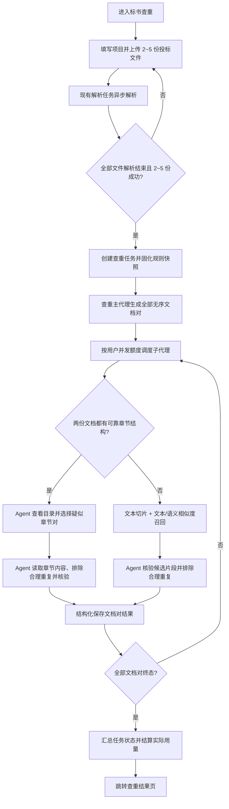

# 标书查重功能设计与开发计划

> 状态：V1 已实现，待执行数据库迁移并在预发布环境联调  
> 日期：2026-07-22  
> 适用项目：`bjt-agent`

## 0. 实施结果（2026-07-22）

本设计对应的 V1 代码已经完成，包含：

- `project_type/task_type/todo_type` 业务隔离和迁移 `022_create_duplicate_check.sql`；
- 2～5 份 `duplicate_bid` 草稿上传、解析和真实章节质量索引；
- 规则 Front Matter 校验、SHA-256 快照和首版规则模板；
- 可靠章节模式与文本/Embedding 召回模式；
- 确定性主编排器、文档对子代理、并发/重试/取消/部分完成/SSE；
- 独立查重 API、执行页、结果页以及历史“检查/查重”切换；
- LLM、Embedding、OCR 用量归集和任务类型化结算；
- 幂等文档对、规则追溯和双边证据校验。

已完成的本地验证：新增及相关后端纯单元测试 20 项通过，前端 `vue-tsc -b && vite build` 通过。数据库集成、真实 LLM/Embedding 调用和 2～5 份真实标书质量验收需在应用迁移后的预发布环境执行。

## 1. 需求确认结论

### 1.1 功能范围

1. 在现有侧边导航增加“标书查重”，内部用户和外部用户均可使用。
2. 查重项目是独立项目类型，与现有“标书检查”项目隔离。
3. 每个查重项目上传同一组投标文件：最少 2 份，最多 5 份。
4. 文件继续复用现有 PDF、DOCX 上传、异步解析、解析进度和内容预览能力。
5. 全部待处理文件解析结束后，用户点击“开始查重”。
6. 主代理按照无序组合生成文档对；每个文档对启动一个查重子代理：

| 文档数 | 文档对/子代理数 |
|---:|---:|
| 2 | 1 |
| 3 | 3 |
| 4 | 6 |
| 5 | 10 |

7. 查重采用双路径：
   - 两份文档都有可靠、完整的章节层次时，由 Agent 主导，通过目录和章节内容工具选择疑似章节对并核验。
   - 任意一份文档没有可靠章节层次时，先切片，再通过文本和语义相似度召回候选片段，最后由 Agent 核验。
8. 查重前排除法规、固定模板、招标文件引用、行业通用表述等合理重复内容；被排除内容不作为可疑重复结果。
9. 不展示“综合相似度百分比”。算法相似度只作为内部候选召回依据，不作为最终用户结论。
10. 查重完成后进入独立结果页，按文档对展示每个子代理的结果。
11. 部分文档对失败时保留成功结果并标记“部分完成”，支持仅重试失败文档对；全部失败才判定整个任务失败。
12. 按实际 LLM Token、Embedding 和云 OCR 成本计费；本地无成本的文本解析不计费。
13. 历史页面增加“标书检查 / 标书查重”切换按钮。
14. V1 不支持结果分享和报告导出。

### 1.2 V1 边界

- 保持现有上传格式和大小限制：PDF、DOCX，单文件最大 500MB。
- 继续沿用现有解析限制；当前无法提取文本的扫描版 PDF 仍提示用户上传文字版 PDF 或 DOCX。若以后在解析阶段增加云 OCR，需要另行设计“文档解析费用归属”，不在本期内扩展。
- 查重结果是辅助判断，不作为认定围标、串标或违法行为的最终法律结论。
- 内部用户与外部用户都能创建和查看自己的查重项目；本期不新增内部用户跨用户查看查重项目的入口。

## 2. 关键设计原则

1. **任务基础设施复用，业务结果隔离**：复用现有项目、任务状态、Celery、SSE、心跳、取消、用量统计和结算机制；查重结果使用独立模型和接口，不硬塞进现有合规风险项结构。
2. **一个文档对一个子代理**：主代理只做确定性编排，不额外消耗模型；子代理独立执行、独立重试、独立落库。
3. **结构模式优先，召回模式兜底**：只在两份文档都被判断为“可靠结构”时使用章节模式，避免把当前虚拟段落误判为真实目录。
4. **证据优先**：最终结果必须能回到两份文档的章节/片段原文；没有双边证据的判断不能作为有效重复项。
5. **规则可追溯**：任务启动时固化规则内容、文件名和 SHA-256，任务执行中不受服务器规则文件被修改的影响。
6. **没有可疑项也是有效结果**：子代理必须生成明确的“未发现可疑重复”结果，不能用空结果代表成功。

## 3. 总体流程



## 4. 文档结构识别与索引

### 4.1 现状问题

现有 `StructureDataLoader.get_toc()` 在找不到 Markdown 标题时会按空行创建“段落 1、段落 2”等虚拟章节。因此不能以“TOC 非空”作为结构化模式的判断条件。

当前 DOCX 解析能够保留使用了标准标题样式的层级；当前 PDF 主解析路径以逐页文本提取为主，通常不会形成可靠 Markdown 标题。结构检测必须基于真实标题并明确记录来源和质量，不能依赖 Agent 猜测。

### 4.2 新增结构索引

每份文档解析完成后生成同目录结构索引文件：

```text
<original_stem>_structure.json
```

主要内容：

```json
{
  "version": 1,
  "quality": "reliable",
  "quality_reasons": ["real_heading_count=28", "max_level=3"],
  "source": "markdown_headings",
  "sections": [
    {
      "section_id": "s1",
      "title": "技术方案",
      "level": 1,
      "parent_id": null,
      "start_line": 120,
      "end_line": 580,
      "page_start": null,
      "page_end": null,
      "is_virtual": false
    }
  ]
}
```

结构质量分为：

- `reliable`：可用于 Agent 章节导航；
- `weak`：存在少量标题，但不足以代表全文结构；
- `none`：没有真实标题；
- `unknown`：结构分析异常，不影响文档解析完成，但查重走兜底路径。

默认可靠性判定由配置控制，至少考虑：真实标题数量、标题层级、标题覆盖范围、异常超长章节比例和虚拟章节占比。只有文档对两边均为 `reliable` 才走结构模式，其余情况统一走召回模式。

### 4.3 定位信息

- Markdown 行号始终记录。
- PDF 能得到页边界时记录页码；DOCX 或无法可靠映射页码时返回 `null`。
- 结果页优先显示“章节 + 页码”，没有页码时显示“章节 + 原文摘录”，不得生成虚假页码。

## 5. 查重规则文件

### 5.1 配置

新增服务端配置：

```text
DUPLICATE_CHECK_RULE_PATH=/home/bjt/bjt_agent/docs/rules-duplicate/duplicate-check.md
```

配置指向单个 Markdown 文件。API 启动查重任务时验证：路径存在、是普通文件、可读、内容非空；验证失败时不创建可执行任务，并向用户返回明确错误。

### 5.2 文件格式

规则文件使用 YAML Front Matter 提供程序可读参数，正文提供 Agent 可读规则。例如：

```markdown
---
version: 1
chunk_size_chars: 1200
chunk_overlap_chars: 150
lexical_threshold: 0.78
semantic_threshold: 0.82
top_k_per_chunk: 5
max_candidates_per_pair: 100
min_evidence_chars: 50
structure:
  min_real_headings: 3
  require_multiple_levels: false
exclude_section_title_patterns:
  - "^(目录|封面|投标函格式)$"
exclude_text_patterns:
  - "^中华人民共和国.*法$"
---

# 查重目标
...

# 应排除的合理重复
...

# 可疑重复的判断规则
...

# 输出要求
...
```

规则加载器必须进行 Pydantic 校验并提供安全默认值。正则表达式需要限制数量和长度，并避免使用可导致灾难性回溯的表达式。

任务启动时：

1. 读取并校验规则；
2. 计算 SHA-256；
3. 把规则内容复制到项目任务目录；
4. 在任务配置快照中保存原始路径、文件名、版本、哈希和快照路径；
5. 所有子代理只读取快照。

## 6. 两种查重执行模式

### 6.1 结构模式

每个子代理按以下强制步骤执行：

1. 读取规则快照。
2. 分别调用目录工具获取文档 A、B 的完整真实目录。
3. 根据章节标题、层级、编号和语义判断可能对应或可疑的章节组合；不能只比较同名章节，也要识别“标题不同但内容相同”的情况。
4. 使用章节内容工具分段读取候选章节，超长章节通过游标分页读取，避免单次工具结果冲垮上下文。
5. 先按规则排除合理重复内容。
6. 对剩余内容进行大模型核验，形成双边证据。
7. 写入符合固定 JSON Schema 的结果并生成 Markdown 报告。

新增或抽取为通用的工具：

| 工具 | 作用 |
|---|---|
| `get_duplicate_document_toc` | 按 `document_id` 返回真实目录、结构质量和章节元数据 |
| `get_duplicate_section_content` | 按 `document_id + section_id` 分页返回章节文本和定位信息 |
| `search_duplicate_document` | 在指定文档内搜索关键词，帮助 Agent 找到标题不同但内容相近的章节 |
| `write_duplicate_result` | 校验并保存最终结构化结果，禁止 Agent 自由写入任意路径 |

查重工具使用 `document_id` 区分两份文档，不沿用现有工具的 `tender/bid` 语义。

### 6.2 无结构召回模式

召回流程：

1. 文本规范化：统一空白、标点和全半角，保留原文偏移映射。
2. 按规则配置切片，默认约 1200 字、重叠 150 字；表格和段落边界优先于固定长度切割。
3. 在召回前应用可程序化的排除规则。
4. 文本通道：精确片段、字符 n-gram/Jaccard 或等价的模糊文本相似度召回。
5. 语义通道：Embedding 余弦相似度召回改写、换序但实质相近的片段。
6. 每个切片仅保留 Top-K 候选，进行双向去重、相邻候选合并，并限制单文档对候选总数。
7. 子代理通过候选工具获取候选和原文，按规则进行最终核验和排除。

新增工具：

| 工具 | 作用 |
|---|---|
| `list_duplicate_candidates` | 分页返回当前文档对的召回候选及内部排序信息 |
| `get_duplicate_candidate_content` | 返回候选两侧完整原文、上下文和定位信息 |
| `write_duplicate_result` | 与结构模式共用，保存最终结果 |

文本/语义分数只用于候选排序和诊断日志，不进入面向用户的结果字段。

### 6.3 排除合理重复

排除分两层：

- **程序层**：Front Matter 中的章节标题、文本正则、最短文本长度等明确规则，在候选生成前执行。
- **Agent 层**：正文规则描述的法规原文、固定格式、行业术语、招标文件引用、通用企业介绍等需要结合上下文判断的内容，在最终核验时执行。

被排除内容：

- 不生成可疑重复项；
- 不参与任何用户可见统计；
- 只保留分类计数和内部诊断信息，便于规则调优；
- 不显示所谓“综合相似度”。

## 7. Agent 编排设计

### 7.1 查重主代理

查重主代理是确定性编排器，不调用 LLM：

1. 验证项目、文件数量和解析状态；
2. 加载规则快照；
3. 对按文档 ID 排序后的列表调用组合算法，生成唯一无序文档对；
4. 为每对创建一条查重 Todo；
5. 使用 JWT 中的用户并发额度和服务端上限共同控制并发；
6. 汇总子代理终态；
7. 生成任务终态并触发用量汇总、结算。

唯一性约束必须保证 `(task_id, min(document_a_id, document_b_id), max(...))` 不会重复创建，Celery 重投也不能重复执行或重复结算。

### 7.2 查重子代理

新增独立 `DuplicateCheckAgent`，不复用 `BidReviewAgent` 的合规提示词和结果解析逻辑，但复用以下基础能力：

- LLM 客户端工厂和并发限流；
- Mini-Agent 生命周期；
- SSE 事件包装；
- 心跳、超时、取消和异常重试；
- UsageContext 用量归属；
- 每 Todo 独立日志。

每个子代理固定绑定：任务 ID、Todo ID、用户 ID、项目 ID、文档 A、文档 B、执行模式和规则快照。子代理不能访问当前文档对之外的其他项目文档。

### 7.3 状态策略

任务状态：

- `pending`
- `running`
- `completed`
- `completed_with_warnings`
- `failed`
- `cancelled`

汇总规则：

- 所有文档对成功：`completed`；
- 至少一对成功且至少一对失败：`completed_with_warnings`；
- 全部失败：`failed`；
- 用户取消：`cancelled`。

子代理重试沿用现有异常保护思路，默认最多 3 次；规则错误、文件不存在、结果 Schema 持续不合法属于不可无限重试错误。

`completed_with_warnings` 也必须结算已实际产生的 LLM、Embedding、OCR 用量。

## 8. 结果模型与展示口径

### 8.1 文档对结论

每个文档对必须产生以下结论之一：

- `suspicious_duplicate`：发现需要人工关注的重复内容；
- `no_suspicious_duplicate`：未发现符合规则的可疑重复；
- `manual_review_required`：证据不足或文档质量导致无法可靠判断；
- `failed`：该文档对子代理执行失败。

### 8.2 结构化结果

```json
{
  "document_a": {"id": "...", "name": "A.docx"},
  "document_b": {"id": "...", "name": "B.docx"},
  "execution_mode": "structured",
  "conclusion": "suspicious_duplicate",
  "summary": "两份文件在实施方案章节存在多处非模板化同义或近似表述。",
  "suspicious_count": 2,
  "excluded_count": 4,
  "matches": [
    {
      "title": "项目实施步骤表述高度一致",
      "duplicate_type": "near_duplicate",
      "document_a_evidence": {
        "section_id": "s12",
        "section_title": "实施方案",
        "page_start": 35,
        "page_end": 36,
        "excerpt": "..."
      },
      "document_b_evidence": {
        "section_id": "s9",
        "section_title": "服务实施计划",
        "page_start": null,
        "page_end": null,
        "excerpt": "..."
      },
      "analysis": "章节名称不同，但步骤顺序、专有表述和错误用词一致，不属于通用模板。"
    }
  ]
}
```

不输出综合相似度。单条证据也不强制显示百分比。

### 8.3 结果页面

新增独立查重结果页：

- 顶部任务选择器，支持查看同一项目的历次查重任务；
- 统计卡：文档数、文档对数、发现可疑重复的文档对数、可疑重复项数；
- 左侧按文档对列出子代理状态和结论；
- 右侧展示该文档对摘要、执行模式、两侧证据、章节/页码和判断说明；
- 部分失败时显示醒目警告和“仅重试失败项”；
- “重新查重”会针对项目现有文档创建新任务，不覆盖旧结果；
- 页面保留“大模型结果仅供参考”的免责声明；
- 不显示分享和导出入口。

## 9. 数据模型

### 9.1 复用并扩展现有表

#### `projects`

新增：

- `project_type VARCHAR(20) NOT NULL DEFAULT 'review'`

取值：`review`、`duplicate`。历史数据全部回填为 `review`。

#### `documents`

扩展 `doc_type`：

- 现有：`tender`、`bid`
- 新增：`duplicate_bid`

新增：

- `structure_quality VARCHAR(20)`
- `structure_index_path VARCHAR(500)`
- `structure_analysis JSONB`

草稿文档按 `doc_type` 隔离，避免用户从检查页切换到查重页时混入另一种业务的草稿。

#### `review_tasks`

该表继续作为通用 Agent 任务承载表，避免重建 SSE、用量汇总和结算主链路。新增：

- `task_type VARCHAR(20) NOT NULL DEFAULT 'review'`
- `config_snapshot JSONB`

查重接口只查询 `task_type='duplicate'`，现有审查接口补充 `task_type='review'` 条件，防止未来错误串读。

#### `todo_items`

新增：

- `todo_type VARCHAR(20) NOT NULL DEFAULT 'review_rule'`
- `display_name VARCHAR(511)`
- `document_a_id VARCHAR(36)`
- `document_b_id VARCHAR(36)`
- `execution_mode VARCHAR(20)`

查重 Todo 的 `todo_type='duplicate_pair'`。现有 `rule_doc_path/name` 暂保留兼容；查重 Todo 填入规则快照路径和文件名。

### 9.2 新增 `duplicate_pair_results`

建议字段：

| 字段 | 说明 |
|---|---|
| `id` | UUID 主键 |
| `task_id` | FK `review_tasks.id` |
| `todo_id` | FK `todo_items.id`，唯一 |
| `document_a_id` | FK `documents.id` |
| `document_b_id` | FK `documents.id` |
| `execution_mode` | `structured` / `retrieval` |
| `conclusion` | 文档对结论 |
| `summary` | 子代理摘要 |
| `suspicious_count` | 可疑重复项数量 |
| `excluded_count` | 被排除项数量 |
| `matches` | JSONB，双边证据列表 |
| `diagnostics` | JSONB，内部候选数量、模式判定理由等；API 默认不返回 |
| `report_path` | Markdown 报告路径 |
| `rule_name/version/hash` | 规则追溯信息 |
| `created_at/updated_at` | 时间戳 |

数据库迁移建议编号：`022_create_duplicate_check.sql`。迁移必须幂等，包含历史回填、索引、唯一约束和必要外键。

## 10. API 设计

### 10.1 项目与文档

| 方法 | 路径 | 说明 |
|---|---|---|
| `POST` | `/api/projects` | 请求新增 `project_type`，默认 `review` |
| `GET` | `/api/projects?project_type=duplicate` | 按项目类型过滤历史 |
| `POST` | `/api/documents/upload?doc_type=duplicate_bid` | 上传查重草稿并开始解析 |
| `GET` | `/api/documents/drafts?doc_type=duplicate_bid` | 只加载查重草稿 |
| `POST` | `/api/documents/{id}/attach?project_id=...` | 关联时校验项目类型与文档类型匹配 |

上传限制必须前后端同时执行：

- 选择文件时阻止总数超过 5；
- 后端草稿上传按用户和 `duplicate_bid` 统计，超过 5 返回 400；
- 开始查重再次校验项目中恰有 2～5 份、全部为 `parsed`；
- 解析失败文件不允许留在待启动集合中，用户需要删除并重新上传。

### 10.2 查重任务

统一前缀：`/api/projects/{project_id}/duplicate-check`

| 方法 | 路径 | 说明 |
|---|---|---|
| `POST` | `/tasks` | 创建并启动查重任务 |
| `GET` | `/tasks` | 查询项目历次查重任务 |
| `GET` | `/tasks/{task_id}` | 查询任务状态 |
| `POST` | `/tasks/{task_id}/heartbeat` | 前端心跳 |
| `POST` | `/tasks/{task_id}/cancel` | 取消任务 |
| `GET` | `/tasks/{task_id}/pairs` | 查询文档对 Todo 和状态 |
| `GET` | `/tasks/{task_id}/results` | 查询所有文档对结果与统计 |
| `GET` | `/tasks/{task_id}/pairs/{todo_id}/report` | 查询单个子代理 Markdown 报告 |
| `POST` | `/tasks/{task_id}/retry-failed` | 仅为失败文档对创建重试任务/重试批次 |

SSE 复用现有 `/api/events/tasks/{task_id}/stream`，事件数据新增 `task_type='duplicate'` 和文档对元数据。至少支持：

- `duplicate_master_started`
- `duplicate_pair_created`
- `duplicate_pair_started`
- `duplicate_pair_step`
- `duplicate_pair_completed`
- `duplicate_pair_failed`
- `duplicate_task_completed`

所有读写接口继续执行项目所有权校验。规则服务器绝对路径、诊断日志路径不得直接返回前端。

## 11. 前端设计

### 11.1 路由与导航

- 新导航：`标书查重`
- 新路由：
  - `/home/duplicate-check`
  - `/home/projects/:id/duplicate-execution`
  - `/home/projects/:id/duplicate-results`

导航项不设置 `internalOnly`。

### 11.2 查重创建页

复用现有检查页的视觉结构：

1. 项目名称、描述；
2. 单一“待查重标书”上传区；
3. 2～5 个文件卡片，显示上传进度、解析进度、解析结果、预览和删除；
4. 全部文件解析完成且成功文件数为 2～5 时启用“立即查重”；
5. 开始时创建 `project_type='duplicate'` 项目、关联草稿、启动查重任务并进入执行页。

建议先抽取检查页和查重页共用的上传卡片、解析进度和草稿管理 composable，避免复制现有上千行页面后形成两套修复点。

### 11.3 执行页

使用与现有审查执行页一致的页面框架，但文案和子代理卡片按文档对展示：

- 主代理阶段：验证规则、生成文档对、开始调度；
- 子代理标题：`文件 A ↔ 文件 B`；
- 显示执行模式：章节分析 / 片段召回；
- 显示等待、执行、完成、失败状态；
- 刷新后从数据库恢复 Todo、步骤和状态，再续接 SSE；
- 完成后自动跳转查重结果页；部分完成也跳转并显示警告。

### 11.4 历史页

历史页顶部增加分段按钮：

- `标书检查`
- `标书查重`

切换时通过后端 `project_type` 查询，不在前端拿全量后过滤。列表操作根据类型进入对应结果页，查重项目显示“查重结果”。

## 12. 计费与用量

### 12.1 计费口径

- 启动查重前与现有检查一样要求余额大于 0。
- 每个子代理设置独立 UsageContext，但 `task_id` 指向同一个查重任务、`todo_id` 指向对应文档对。
- LLM Token、Embedding 请求和云 OCR 调用全部记录到 `ai_usage_records`。
- 任务成功、部分完成、失败或取消后，都要刷新任务用量汇总；有实际消耗时按现有成本换算规则结算。
- 结算以任务 ID 做唯一键，Celery 重投、接口重试和终态重复处理不能重复扣费。
- 本地文本切片、Jaccard/哈希计算、本地文档读取不计费。

### 12.2 现有链路改造

现有 `usage_summary` 只从 `review_tasks` 合并状态，因此选择复用该任务表可保持主链路稳定；需补充 `task_type` 到任务汇总和运营同步字段。

现有 `settle_review_consumption()` 需要泛化为按任务类型结算：

- `review`：描述“AI检查”；
- `duplicate`：描述“AI查重”；
- `completed_with_warnings` 视为可结算终态；
- 失败/取消任务若已经产生实际费用，也按已产生用量结算，避免成本漏记；产品界面需明确显示实际消费记录。

Embedding 当前没有完整进入用量流水，开发时需补充 `usage_type='embedding'` 及成本统计，或统一折算进 Token 成本；不能让无结构兜底路径产生未记录的第三方费用。

## 13. 异常、幂等与安全

### 13.1 异常处理

- 规则文件不可读：启动失败，不派发 Celery。
- 文档数不合法或未解析完成：启动失败，返回具体文件状态。
- 结构分析失败：不让任务失败，自动降级召回模式。
- Embedding 服务失败：允许在规则配置下退化为文本召回；若文本召回也失败，该文档对失败。
- 单个子代理结果 JSON 不合法：自动修复一次，仍失败则按重试策略重跑。
- 单对失败：其他文档对继续执行。
- SSE 中断：前端退化轮询并从 DB 恢复；任务不因单纯页面刷新立即取消。
- 规则或模型产生无双边证据结论：Schema 校验拒绝保存为有效可疑项。

### 13.2 幂等

- 项目内同一时间只允许一个运行中的查重任务。
- 文档对使用规范化 ID 顺序和数据库唯一约束。
- 结果对 `todo_id` 唯一，重试使用覆盖或明确的新尝试记录，不能重复累计。
- 结算继续使用 `consumption_records.task_id` 唯一约束。
- Celery 任务启动、终态更新和 SSE 完成事件均允许重复调用而不破坏数据。

### 13.3 安全

- 所有文件和任务接口进行用户/项目归属校验。
- Agent 工具只接受已绑定的文档 ID，不能传任意文件路径。
- 规则文件路径只能来自服务端配置，前端不能指定。
- 结果摘录需限制最大长度并经过 Markdown/HTML 安全渲染。
- 日志避免记录完整标书内容；完整交互日志沿用现有受控 workspace，不通过 API 暴露。

## 14. 测试与验收标准

### 14.1 后端单元测试

- 组合生成：2/3/4/5 份分别生成 1/3/6/10 个唯一无序对。
- 上传限制：第 6 份由后端拒绝；并发或重复请求不能绕过启动校验。
- 项目类型、草稿类型和任务类型严格隔离。
- 真实章节与虚拟段落能够正确区分。
- 两边 `reliable` 才走结构模式；混合结构自动走召回模式。
- 切片保留原文偏移，候选 Top-K、合并和数量上限正确。
- 排除规则在程序层生效。
- 规则快照哈希稳定，规则变更不影响运行中任务。
- 结果 Schema 拒绝缺少双边证据的可疑项。
- 部分失败、全部失败、取消和重试状态正确。
- 用量汇总、Embedding 成本和结算幂等。

### 14.2 API 测试

- 内外部用户都可创建自己的查重项目。
- 普通用户不能访问其他用户的查重项目。
- 1 份或 6 份文件不能启动；2～5 份可启动。
- 存在 pending/parsing/failed 文件时不能启动。
- 任务、文档对、结果、报告、取消、心跳和失败重试接口权限正确。
- 审查接口不会返回查重任务，查重接口不会返回审查任务。

### 14.3 Agent 与算法测试集

至少准备以下固定夹具：

1. 两份有完整目录、同名章节存在明显重复；
2. 两份有完整目录、章节名不同但内容重复；
3. 一份有目录、一份无目录，必须走召回模式；
4. 两份无目录，包含逐字重复；
5. 两份无目录，包含同义改写；
6. 只有法规、固定模板和招标引用相同，结果应无可疑项；
7. 文档完全不同，结果应为 `no_suspicious_duplicate`；
8. 超长章节和超多候选，验证分页、候选上限和上下文稳定性。

### 14.4 前端验收

- 内外部用户均能看到“标书查重”导航。
- 创建、上传、解析、刷新恢复、删除、预览、开始查重闭环可用。
- 5 份文档执行页展示 10 个且仅 10 个文档对子代理。
- 部分失败能进入结果页并仅重试失败项。
- 结果页按文档对展示双边证据，不出现综合相似度百分比。
- 历史页“标书检查 / 标书查重”切换正确，跳转到对应结果页。
- 查重结果页没有分享和导出入口。

### 14.5 计费验收

- 同一任务所有子代理 LLM、Embedding、云 OCR 用量正确归集。
- 完成、部分完成、失败、取消场景均不漏记已发生成本。
- 重复终态回调、Celery 重投、重复刷新不重复扣费。
- 消费记录显示项目名称、查重任务类型、实际成本、扣除文数和积分。

## 15. 开发计划

### 阶段 0：规则与测试样本准备

- 与业务方确定首版查重规则正文和可程序化排除项。
- 建立结构化/无结构/合理重复/可疑重复测试样本及人工期望结果。
- 确认生产环境 Embedding Provider 和计价方式。

交付：规则模板、首版规则、验收样本清单。

### 阶段 1：数据模型与通用任务改造

- 编写迁移 `022_create_duplicate_check.sql`。
- 扩展 Project、Document、ReviewTask、TodoItem 模型和 Schema。
- 新增 DuplicatePairResult 模型。
- 所有现有审查查询补充 `task_type='review'` 防串读。
- 配置规则路径、阈值和任务超时。

交付：可迁移数据库、模型测试、现有审查回归测试通过。

### 阶段 2：查重项目、上传与结构索引

- 后端支持 `duplicate_bid` 草稿、2～5 限制和项目类型匹配校验。
- 抽取前端共用上传/解析组件和草稿 composable。
- 新增查重创建页。
- 解析完成后生成结构索引和质量判定结果。
- 补充页码/行号可用时的定位映射。

交付：用户可创建查重项目、上传 2～5 份文件并得到结构质量。

### 阶段 3：规则快照与查重工具

- 实现规则 Front Matter 解析、校验和快照。
- 实现目录、章节分页、文档搜索工具。
- 实现切片、文本召回、Embedding 召回、候选合并和候选读取工具。
- 实现结果 JSON Schema、写入工具和 Markdown 报告生成。

交付：工具级测试和固定样本召回测试通过。

### 阶段 4：主代理、子代理与任务链路

- 实现 DuplicateCheckMaster 确定性编排。
- 实现 DuplicateCheckAgent 双模式提示词和工具集。
- 实现并发、心跳、超时、取消、重试、部分完成和仅重试失败项。
- 接入 Celery review 队列、SSE 和数据库恢复。

交付：后端端到端任务可处理 2～5 份文档并生成全部文档对结果。

### 阶段 5：执行页、结果页与历史页

- 新增导航和路由。
- 新增查重执行页，复用任务时间线框架。
- 新增查重结果页和双边证据展示组件。
- 历史页增加“标书检查 / 标书查重”切换。
- 增加重新查重、仅重试失败项和免责声明。

交付：完整用户闭环，内外部用户界面验收通过。

### 阶段 6：计费、运营同步与可观测性

- 记录 Embedding 用量及成本。
- 泛化任务终态汇总和结算逻辑。
- 运营同步增加任务类型，核对现有 operate-two 消费记录兼容性。
- 增加查重任务、模式、候选量、子代理耗时、失败原因等结构化日志和指标。

交付：计费幂等测试、运营同步测试、系统状态与日志可排障。

### 阶段 7：集成测试、预发布与上线

- 完成单元、API、Agent、算法、前端和回归测试。
- 使用 2～5 份真实脱敏标书压测 Token、耗时、候选数和并发。
- 在预发布环境执行数据库迁移和完整验收。
- 生产先部署规则文件和环境变量，再迁移数据库、发布代码、滚动更新 3 个计算节点。
- 观察查重准确性、任务时长、失败率和费用后逐步放量。

交付：预发布验收记录、上线步骤、回滚步骤和生产观察报告。

## 16. 预计改动范围

主要新增文件预计包括：

```text
backend/
  agent/duplicate_check_agent.py
  agent/duplicate/master.py
  agent/duplicate/executor.py
  agent/tools/duplicate_structure_tools.py
  agent/tools/duplicate_retrieval_tools.py
  services/duplicate_rule_loader.py
  services/duplicate_structure.py
  services/duplicate_retrieval.py
  models/duplicate_pair_result.py
  schemas/duplicate_check.py
  api/duplicate_check.py
  tasks/duplicate_tasks.py
  migrations/022_create_duplicate_check.sql

frontend/src/
  views/DuplicateCheckView.vue
  views/DuplicateExecutionView.vue
  views/DuplicateResultsView.vue
  components/duplicate/*
  composables/useDraftDocuments.ts
```

现有文件至少涉及：配置、模型导出、主应用路由、Celery 路由、项目/文档 API、项目 Store、类型定义、侧边导航、历史页、计费和用量汇总。

## 17. 风险与控制措施

| 风险 | 影响 | 控制措施 |
|---|---|---|
| PDF 解析不产生可靠标题 | 结构模式覆盖率低 | 明确结构质量，自动降级；后续可评估启用 Docling 结构产物 |
| Agent 只按同名章节比较导致漏检 | 查重召回不足 | 规则强制考虑异名章节，提供文档搜索；用异名章节样本验收 |
| 长章节超出上下文 | 子代理失败或漏检 | 章节内容游标分页、候选限制、上下文压缩和任务超时 |
| 无结构模式候选爆炸 | Token 和耗时失控 | 双通道 Top-K、相邻合并、每对候选上限和内部诊断 |
| 合理模板被误报 | 用户不信任结果 | 程序排除 + Agent 排除双层机制，规则可追溯、样本回归 |
| 5 份文档产生 10 个长任务 | 总耗时较长 | 并发限制、单对独立状态、部分结果可保留、预发布实测后定超时 |
| 规则运行中被修改 | 同任务结果不一致 | 任务启动时复制快照并记录 SHA-256 |
| Embedding 成本未记账 | 公司承担隐性成本 | 把 Embedding 纳入用量流水和结算测试 |
| 新任务混入现有审查接口 | 历史和结果串读 | project/task/todo 三层类型隔离，所有查询显式过滤 |
| 部分失败重复扣费 | 用户资产错误 | 任务级唯一结算、Todo 结果幂等、Celery 重投测试 |

## 18. 完成定义

满足以下条件才视为功能完成：

1. 内外部用户均可从导航进入查重并完成 2～5 份文件的全流程。
2. 文档对数量严格符合组合数且无重复、无遗漏。
3. 可靠结构文档走 Agent 章节模式；无结构或混合文档走召回兜底模式。
4. 合理重复被排除，可疑项包含可验证的双边原文证据。
5. 结果页按每个子代理/文档对展示，不显示综合相似度。
6. 部分失败可查看成功结果并仅重试失败项。
7. 历史页面可在检查与查重之间切换。
8. Token、Embedding、云 OCR 用量可追溯，扣费幂等。
9. 现有标书检查、历史、结果、计费和生产集群流程回归通过。
10. 预发布环境完成真实脱敏文档验收并形成上线/回滚记录。
